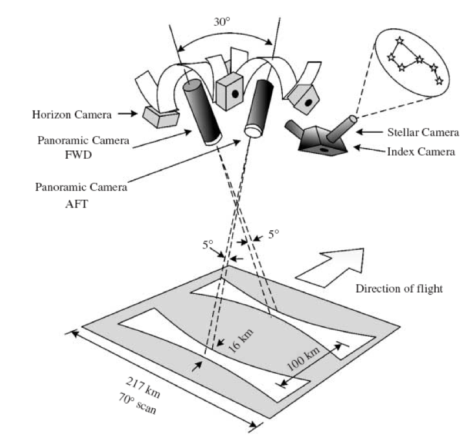
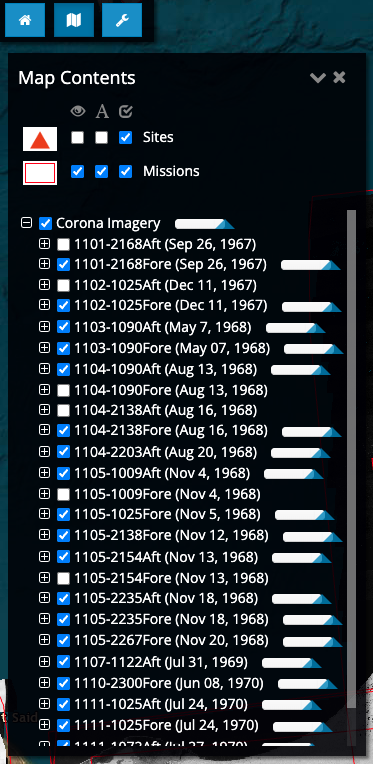
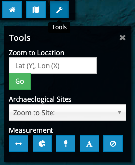

# CORONA and HEXAGON Imagery

## Background and Objectives

In this lab we will learn how to find and use declassified CORONA and HEXAGON satellite imagery. We will learn some basic tools for using raster and vector data in a GIS framework and will explore the ways in which archaeological features appear on historical imagery. We will then attempt to identify sites and ancient roadways in a region of eastern Syria.

This first page will guide you to acquire a corrected CORONA image.

## Acquiring Raw Imagery (Optional)

CORONA images can be searched and downloaded or purchased from the USGS through their EarthExplorer site: <http://earthexplorer.usgs.gov/>. If you want to see all the available CORONA images, you can find them under `Data Sets` -\> `Declassified Data` -\> `Declass 1 (1996)`. HEXAGON images can be found under `Declass 3 (2013)`.

By checking the `Stereo High` option under `Additional Criteria` -\> `Camera Resolution`, you can search for only the latest generation KH-4B CORONA imagery, by checking `Stereo Medium` you can see KH-4A imagery. Note however that none of this imagery has been orthorectified. It is highly distorted and cannot be used for mapping purposes. By selecting a single point in your area of interest in the `Search Criteria` tab, EarthExplorer will return all possible images that cover the point.

::: callout-tip
**How to choose the best image?** Use the footprint tool to see the approximate area covered by each frame. You can also press the `Show Metadata and Browse` icon under each image to see image details. Pay close attention to the acquisition date.
:::

### CORONA and HEXAGON Nomenclature

All CORONA images have a unique entity ID number that looks like this: `DS 1102-1025D A042`. These numbers can be parsed as follows:

| PART | ID | MEANING |
|-------------|-------------|-----------------------------------------------|
| DD | `D3` | “Declassified Satellite” so all of them are “DS” |
| SS | `11` | Sensor generation. KH4B is 11xx, KH4A is 10xx, KH4 is 90xx, etc… |
| MM | `02` | Mission number. KH4B range from 1101-1117, KH4A range from 1001-1064 |
| -B | `-1` | Bucket number. Satellites were equipped with 2 buckets |
| RRR | `025` | Revolution number. Satellite orbited up to 275 times |
| O | `D` | “Descending” orbit; most CORONA missions following a descending polar orbit |
| C | `A` | A or F indicates Aft or Forward camera |
| FFF | `042` | Frame number. A running frame number for each bucket |

Similarly, an entity ID for HEXAGON images, such as `D3C 1219-300919 A026`, can be decoded as such:

| PART | ID | MEANING |
|-------------|-------------|-----------------------------------------------|
| DD | `D3` | Declassified Satellite Imagery 3 ("Declass 3"), the KH-9 HEXAGON collection |
| S | `C` | Status, where C indicates Complete |
| SSMM-B | `1219-3` | Sensor, mission, and bucket number |
| OOOOO | `00919` | Operations number, zero-padded to five digits |
| C | `A` | Camera |
| FFF | `026` | Frame number |

## Getting [Orthorectified](https://www.esri.com/about/newsroom/insider/what-is-orthorectified-imagery) Images

CORONA and HEXAGON satellites used a cross-path panoramic camera that produced elongated film strips. The imaging geometry of the camera and the surface of the earth result in a “bow tie” area of the ground being compressed into the rectangular area of the film. Further, the image motion compensators built into the imaging system did not fully account for the satellites motion during the image scan, which creates an “S” shaped pattern of distortion from one side of the image to the other. A third source of image distortion is derived from the topography of the ground as the parallax changes between the ground and the imaging surface inside the camera. These characteristics result in severe spatial distortions that radically alter the shape and size of individual features, in opposite directions on forward and aft cameras.

{width="60%"}

::: callout-note
Tools such as [SUNSPOT](https://sunspot.cast.uark.edu/) allow you to correct these distortions by selecting multiple ground-control points against contemporary satellite imagery.
:::

### CORONA Atlas

For this lab, we will use previously orthorectified CORONA images from the CORONA Atlas Project (<http://corona.cast.uark.edu/index.html>).

Open the link above and explore the Atlas. Areas with available CORONA imagery are shown outlined in red, and mission numbers indicated (if you zoom in), overlaid on modern Google Maps data:

In the drop-down [Map Contents](#atlas-map-contents) window, sites and mission numbers can be toggled on and off. Drop down the CORONA tab to reveal mission numbers and dates of imagery available in the display window.

::: callout-tip
Slider bars appearing to the left of each image series can be used to fade on or off individual missions, or all CORONA simultaneously to facilitate comparison with modern imagery. At the bottom of the screen there is also a swipe tool to reveal modern imagery on the right and CORONA on the left.
:::

{#atlas-map-contents width="54%"}

Using the [Tools Menu](#atlas-tools) The tools menu offers several important functions. You can enter coordinates in Lat/Long (decimal degrees) to zoom to a particular location. You may also change the basemap to several different options. The Atlas also offers a basic archaeological site database for certain regions of the world, to aid as a navigational guide for archaeological research. At the bottom of the tools menu there are several measurement and mapping tools, enabling you to measure distance, area and points.

{#atlas-tools width="41%"}

::: callout-important
## QUESTION 1

In CORONA Atlas, locate the archaeological site of Tell Beidar (Beydar) in Syria (40.5872, 36.7382), the large Early Bronze Age (3000-2000 BC) site at the center of our lab project. Using Area Measurement Tool, measure the area within the outer wall. Report the number in your lab response.
:::

::: callout-important
## QUESTION 2

At least three different CORONA missions are available for the Tell Beidar area. Use the Map Contents tool to turn on and off different options. Which missions and cameras do you think are best for archaeological visibility? Why?
:::

### Download CORONA imagery from the Atlas

In order to download imagery from the CORONA Atlas, go to the [Map Contents](#atlas-map-contents) menu, drop down the CORONA imagery tab, and then drop down the Mission/Revolution series. Simply push the download button to the right of an individual frame to begin the download.

For this lab, we will be using the CORONA image `1105-1025F057`, which covers the Tell Beidar area. Download it from Map Contents window. You will be given a prompt to select a download for either a GeoTIFF image or an NITF — select GeoTIFF.

::: callout-note
You can also use this alternative link to download the image.
:::
