## Background Objectives

The rapidly growing sophistication of small, commercial drones or “UAVs” (unpiloted aerial vehicles) combined with the increasing power of digital photogrammetry software to produce 3D models and [orthoimagery](#Orthophoto) has begun to transform archaeological documentation and discovery. While just a few years ago, collecting low altitude aerial imagery was costly, cumbersome, and often dangerous, today it can be done reliably, quickly, and at low cost. Moreover, a growing range of small, lightweight cameras and sensors open new possibilities not only to map sites and landscapes, but to discover new sites and features that would otherwise be invisible.

::: {#Orthophoto .callout-note}
## Orthoimagery

An “[orthophoto](https://en.wikipedia.org/wiki/Orthophoto)” is a photograph that has had all spatial distortions, caused by both camera parallax and ground topography, corrected such that it can be used as a map. If we process a bunch of photos together to produce a larger mosaic, then we have made an “ortho-image."
:::

In this lab, we will learn to process a series of drone-acquired images to produce high-resolution orthoimagery and a [digital elevation model](https://en.wikipedia.org/wiki/Digital_elevation_model) (DEM) of an archaeological site called Echo Canyon (Echo Mesa), located on the Hopi Reservation in Arizona. Collaborating with the Hopi Cultural Preservation Office, our team from the Spatial Archaeometry Lab (SPARCL) at Dartmouth has been undertaking drone-based surveys of numerous sites in order to assist with management and locate potentially unrecorded archaeological features.

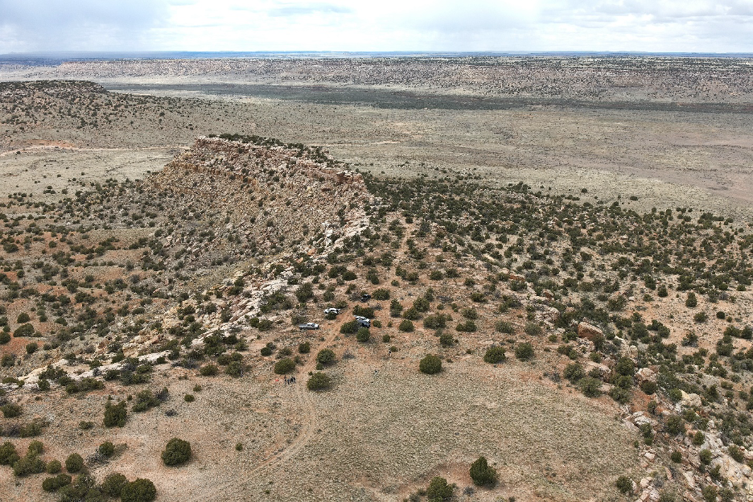{fig-align="center" width="100%"}

Archaeologists [Greg Schachner](https://ioa.ucla.edu/people/gregson-schachner) (UCLA) and [Wes Bernardini](https://www.redlands.edu/faculty-and-staff-directory/sociology-and-anthropology/wesley-bernardini) (University of Redlands) previously did a systematic surface survey of Echo Canyon and recorded many archaeological features, including stone building foundations, circular storage pits, and refuse middens replete with artifacts. Our job is to see if we can locate any of these features and potentially find unrecorded features using drone imagery.

For this lab, we will be processing color drone images collected with a DJI M300 Enterprise drone, equipped with a 20MP visible light camera and a high-accuracy RTK GNSS (GPS). You will use a subset of these photos to create an orthoimage and a DEM of an area where archaeologists have previously recorded surface artifact scatters and potential building remains. We will then open these data in QGIS and compare them with a thermal image mosaic of the same site, publicly available color imagery, and observations of archaeological features that were mapped by our colleagues.

## File Download

For this lab, you will need to download the following files.

1.  [`Raw_Color_Photos`](https://drive.google.com/drive/folders/1m_myuyQaoDzMbRXB0MKNaSP4EYJVFk-s?usp=sharing): A folder that contains 34 color photos shot by the drone. You may need to unzip the file.

2.  [`echocanyon_thermal_8may25_utm.tif`](https://drive.google.com/file/d/1d833rrPJTxEIo5iGkrgiiV_JRnur6azk/view?usp=sharing): A thermal mosaic of the study region.

3.  [`EchoMesa_GroundSurvey.gpkg`](https://drive.google.com/file/d/1Vi-unK5Gnmq_jnRBdYYuzSMUgzxDO_1r/view?usp=sharing): A geopackage that contains multiple vector datasets of archaeological features previously mapped.

## Metashape Setup

For this lab, we will be using Agisoft Metashape. Follow the instruction on [this page](Metashape.qmd) to install the software.

After activating the software, start a new file (`File` -\> `New`) and save the project with a descriptive name such as `DigitalArch_EchoMesa_Your_Name` in a folder with the other files that you have just downloaded.

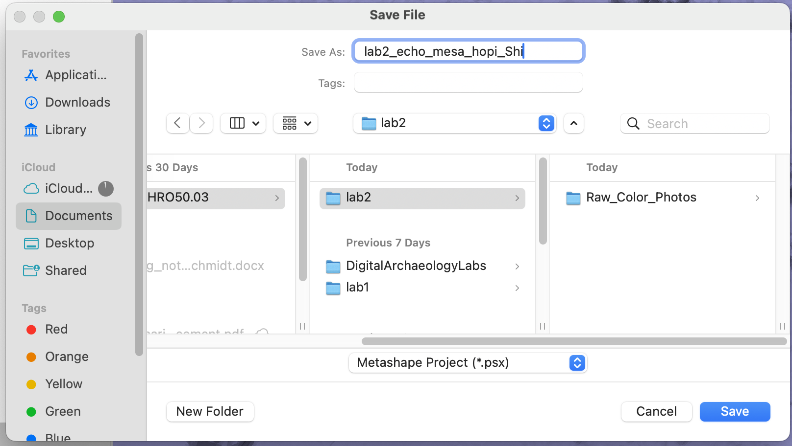

### Add Photos

To add photos to make a 3D model, right-click on `Chunk 1` in the `Workspace`, select `Add` -\> `Add Photos...`, choose all 34 photos from `Raw_Color_Photos`, and click the `Open` button.

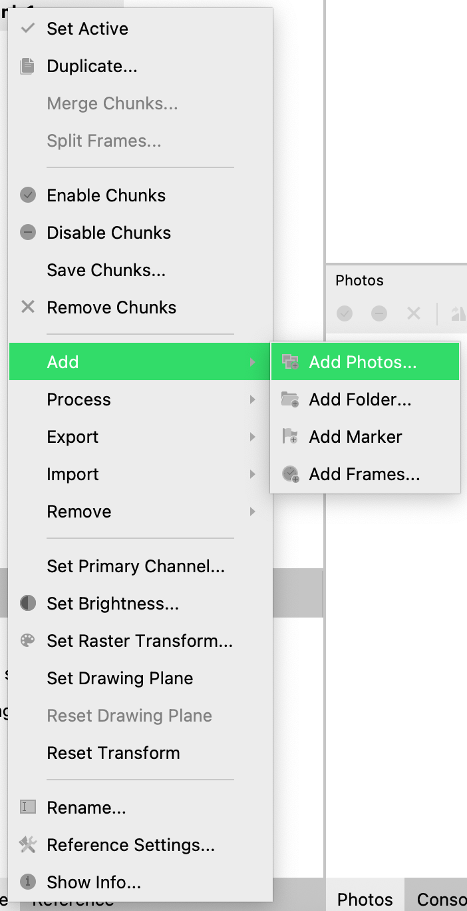{fig-align="center" width="60%"}

Because these photos already have GPS points, Metashape will be able to position them correctly. Toggle `Show Cameras` {width="5%"} to see these locations.

### Align Photos

At this stage we want to refine the camera position for each photo and builds a sparse point cloud. Select `Align Photos` command from the `Workflow` menu.

Set the following values for the parameters in the `Align Photos` dialogue:

- **`Accuracy`:** High (lower accuracy settings can be used to get the rough camera positions in the shorter time)

- **`Generic preselection`** and **`Reference preselection`** should be checked.

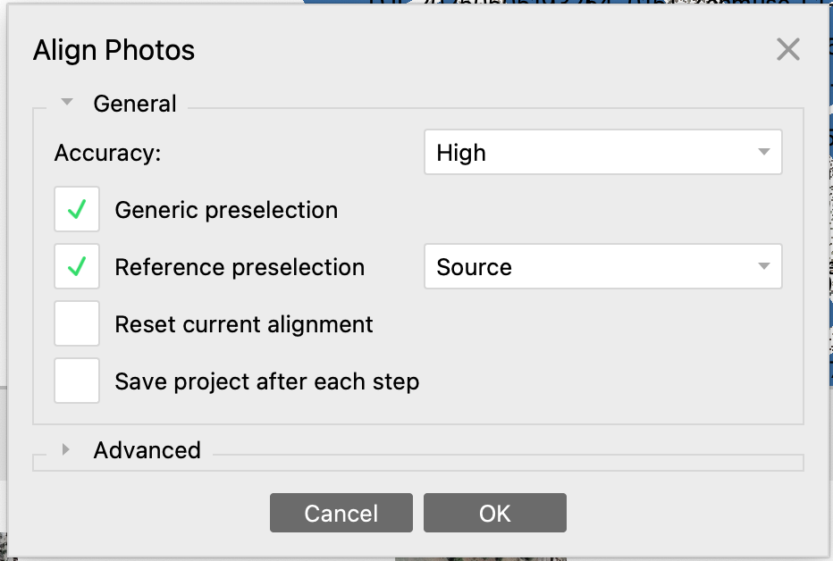{fig-align="center" width="60%"}

Click `OK` button to start photo alignment. This may take a while, but will align the photos and produce a point cloud in which you can see some of the features from the scene, as below:

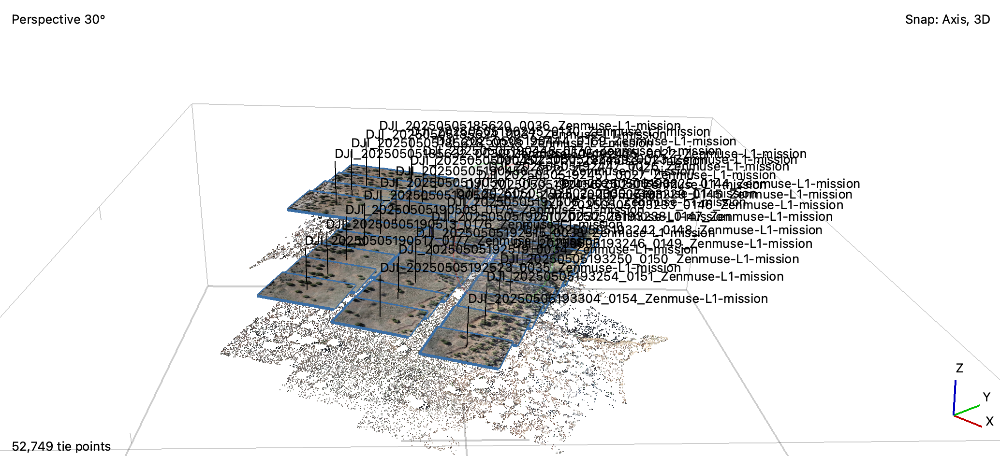{fig-align="center" width="100%"}

The Move Region 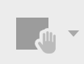{width="5%"} tool is used to define the area you hope to map and can be used to eliminate extraneous datapoints. It is resizable and rotatable. Adjust it to a position you think looks good. Make it approximately the same size as the sparse point cloud you generated.

::: callout-tip
Use the mouse scroll or holding `option`/`alt` to pan the view.
:::

## Photogrammetry

### Build Point Cloud/Dense Cloud

Based on the estimated camera positions, Metashape now creates a single dense point cloud. Select `Build Point Cloud` command from the `Workflow`menu.

Set the following recommended values for the parameters in the `Build Dense Cloud` window:

- **`Quality`:** Low (higher quality takes quite a long time and demands more computational resources)

- **`Depth filtering`**: Mild (if the geometry of the scene to be reconstructed is complex with numerous small details on the foreground, then it is recommended to set Mild depth filtering mode, for important features not to be sorted out)

Click `OK` button to start building dense point cloud. When finished, be sure to turn on the `Point Cloud` option {width="5%"} at the top, and turn off `Show Cameras` to see the results better.

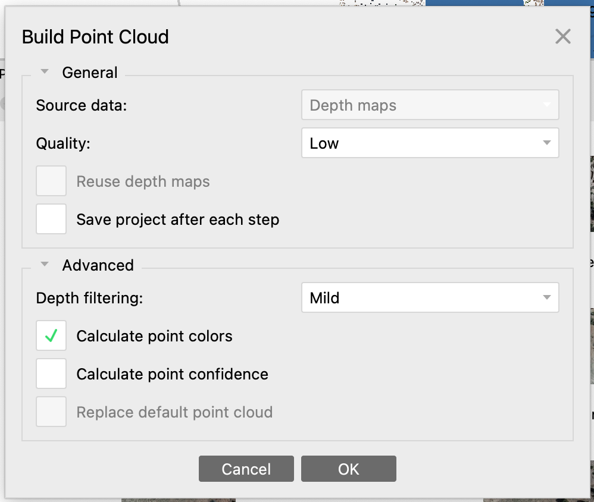{alt="Build point cloud in Metashape" fig-align="center" width="60%"}

### Build a Model/Mesh

After the dense point cloud has been reconstructed it is possible to generate a high-quality polygonal mesh model based on the dense cloud data, basically filling in areas between points in the point cloud to create a continuous surface. Select `Build Model` command from the `Workflow` menu.

Set the following recommended values for the parameters in the *Build Mesh* dialog:

- `Source data`: Point cloud

- `Surface type`: Height field (2.5D)

- `Face count`: Medium (for faster processing)

Click `OK` button to start mesh reconstruction and ignore the warning.

You can now turn on the `Model - Solid` option ({width="5%"}) in the toolbar. Notice the areas in the mesh that look better and worse compared to the point cloud.

### Build Texture

Next we will use the original photographs to map details (“texture”) onto the 3D model we are creating.  This will make it look a lot better but does not actually improve the underlying model.

Select `Build Texture` command from the `Workflow` menu. Use the following values for the `Build Texture` dialog:

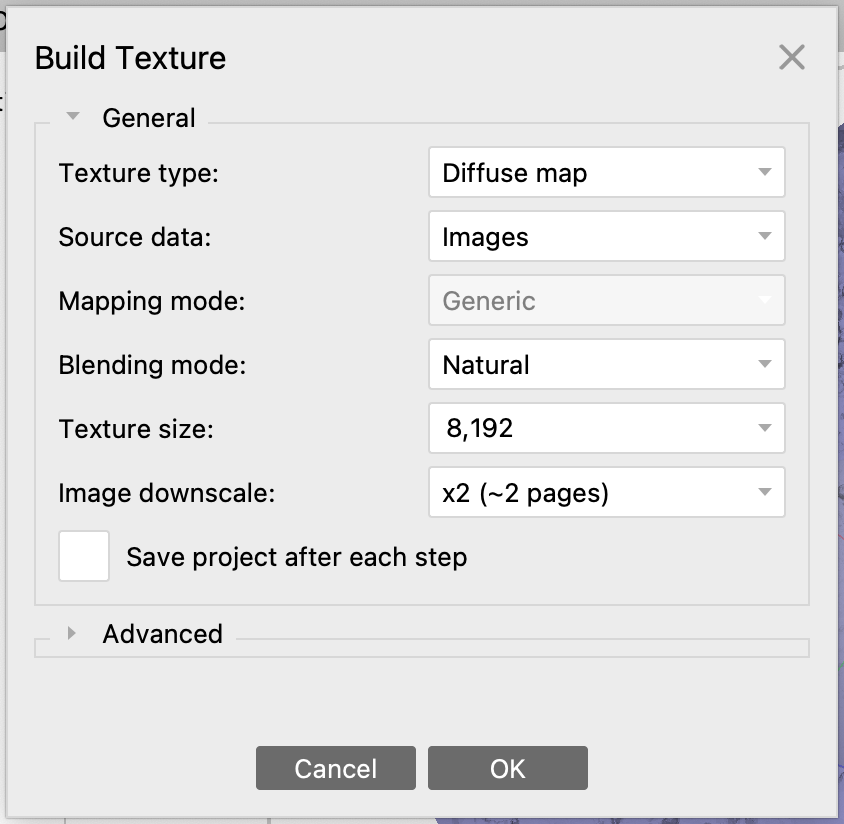{fig-align="center" width="60%"}

Click `OK` button to start texture generation. This process may take a while. When it is done, turn on the textured model using the pyramid-shaped icon on the toolbar:

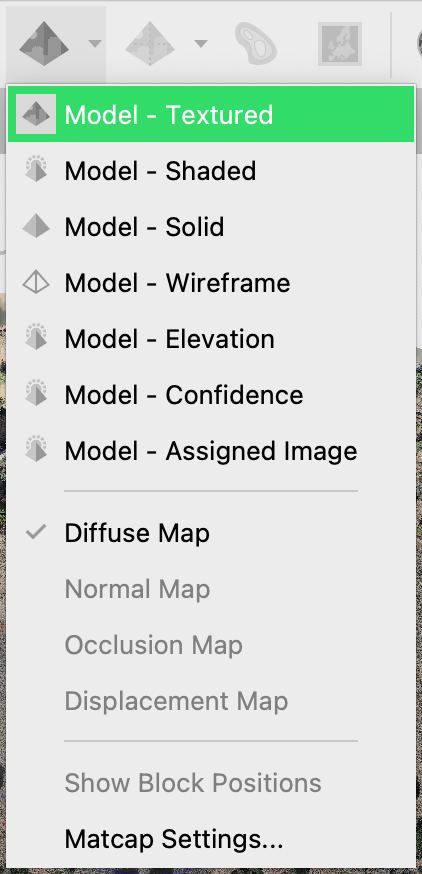{fig-align="center" width="40%"}

Your model now should look approximately like this:

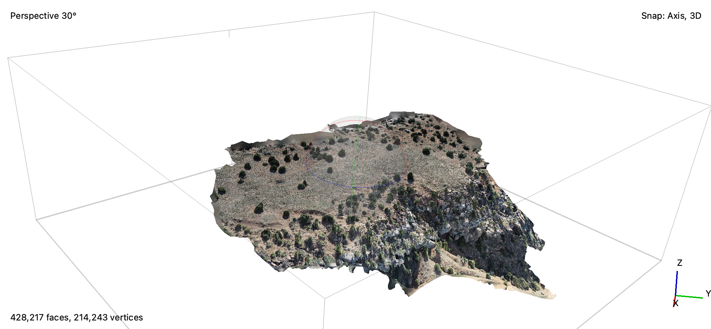{fig-align="center" width="100%"}

### Build a DEM

Select `Build DEM` from the `Workflow` menu.  

Set the following recommended values for the parameters in the `Build DEM` window:

- `Projection`: WGS 84 / UTM zone 12N (EPSG:32612)

- `Source data`: Model/Mesh

- `Resolution`: Default

After DEM generation, click `File` -\> `Export DEM...`. Save the DEM with a descriptive name and select type `TIFF/GeoTIFF`. Check the `Coordinate System` is EPSG:32612.

### Generate an [Orthoimage](#Orthophoto)

Select `Build Orthomosaic…` from the `Workflow` menu.

Set the following recommended values for the parameters in the `Build Orthomosaic` window and Click `OK` to start orthophoto generation.

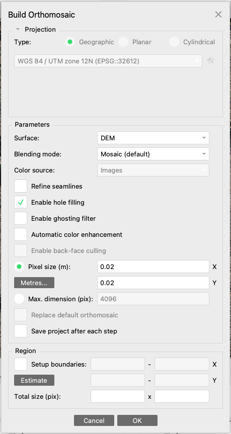{fig-align="center" width="80%"}

Finally, select `File` -\> `Export` -\> `Export Orthomosaic...` and select `TIFF/GeoTIFF` as the file type. Save your orthophoto with a descriptive name, such as `DigitalArch_EchoMesa_Ortho_Date`.

::: callout-important
## EXERCISE 1

Report, in that order, the following values in your Metashape project: number of tie points; number of Point Cloud points; spatial resolution of DEM; image size of the orthomosaic; and the file size of the orthomosaic.
:::
