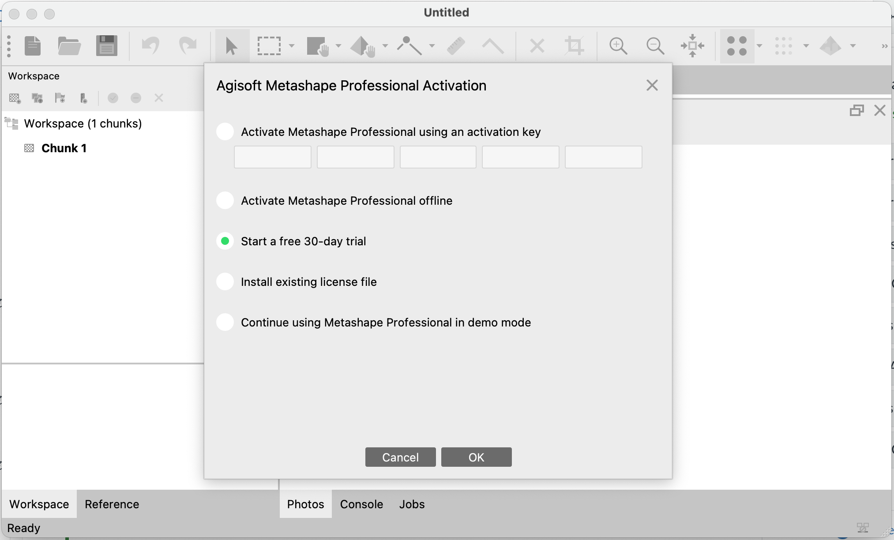

On this page, you will be guided to install Metashape, one of the leading photograpmmetric processing software. First, download their installer based on your OS: <https://www.agisoft.com/downloads/installer/>. Run the installer as administrator; you may need to enter your OS login credentials.

{fig-align="center" width="40%"}

## Version

Please note that we will be using **Agisoft Metashape 2.3.2 Professional Edition**.

## Activation

For now, we will be using a free 30-day trial. Open Metashape and select `Start a free 30-day trial` in the pop-up `Activation` window. Depending on your OS, you may need to enter your log-in credentials again.

{fig-align="center" width="80%"}

::: callout-note
Please note that the interface/nomenclature may look different depending on your OS. The screenshots in this tutorial were captured using macOS.
:::
