## Project Setup in QGIS

This page will guide you to analyze archaeological features in Echo Mesa using the [orthomosaic](Drone_photogrammetry.qmd) you have just generated. Start QGIS and open a new project. Save it (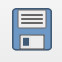{width="5%"}) in your Digital Archaeology Lab folder with a filename such as `lab2_EchoMesa_Hopi_Your_LastName.qgz`.

Change the `CRS` to `EPSG:32612` to match that of the orthomosaic.

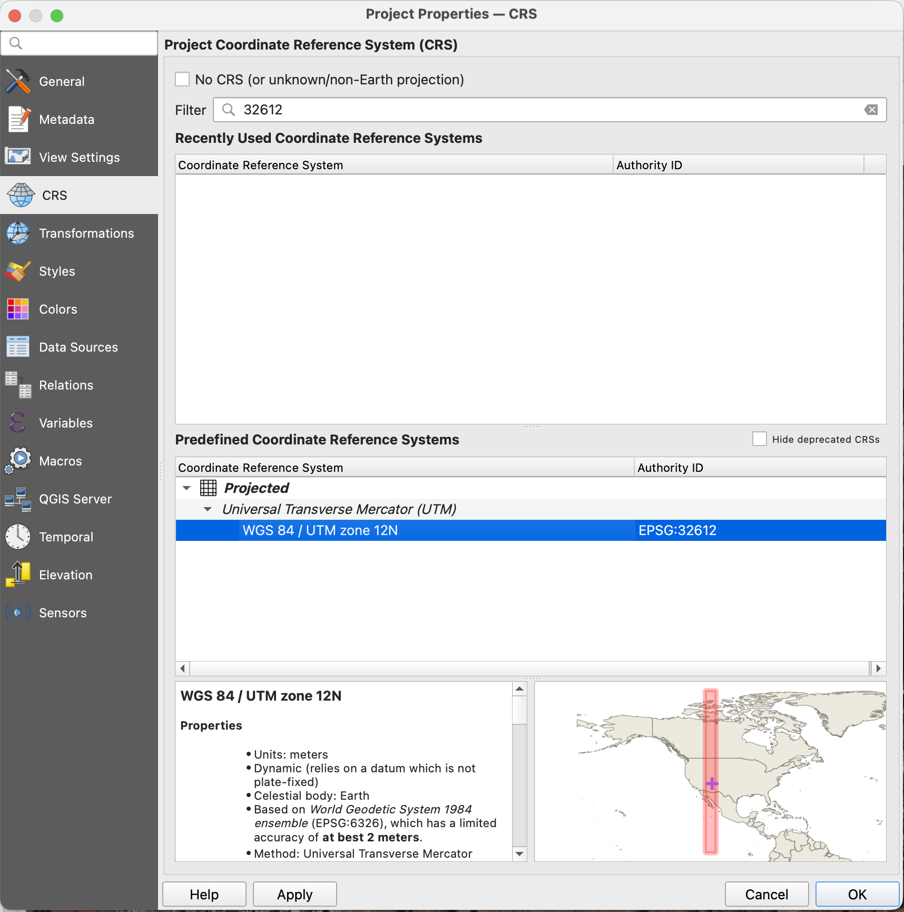{fig-align="center" width="60%"}

As before, from the `Browser` panel, drag a basemap such as `Bing maps` from `XYZ Tiles` to your `Layers`.

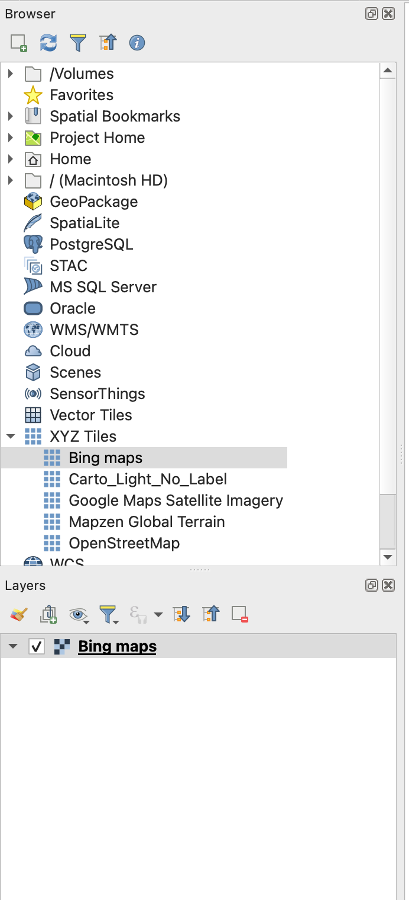{fig-align="center" width="60%"}

If any of the panels are not there, select `View` -\> `Panels` to toggle them on.

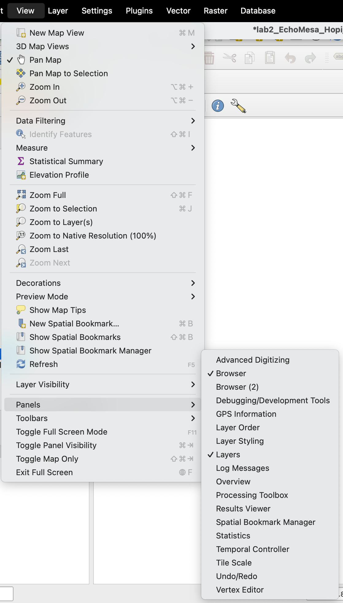{fig-align="center" width="60%"}

## Adding Data

### Orthomosaic and DEM

In QGIS, add both the DEM and orthomosaic `.tif` files as raster layer. In the `Layers` panel, toggle off DEM and compare the resolution between the orthomosaic and the basemap.

::: callout-important
## EXERCISE 2

Compare our 2-cm-resolution drone image to the basemap. List, with screenshots or coordinates, at least three additional features that are only resolved in the orthomosaic.
:::

### Archaeological Features

Next, add `EchoMesa_GroundSurvey.gpkg` that you downloaded as a vector layer. When asked, select all items to add.

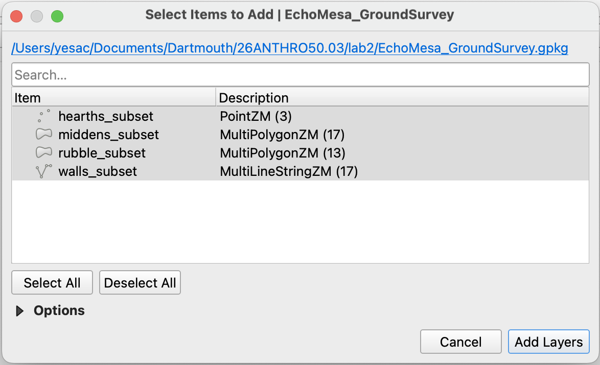{fig-align="center" width="60%"}

Next, convert these vectors to UTM zone 12N:

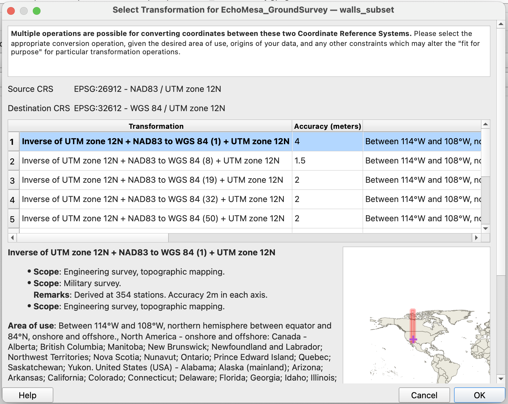{fig-align="center" width="60%"}

In the `Layers` panel, select all four vector layers added, right-click on them, and choose `Group Selected`. Name the group as `ground_survey_data`. Now you can toggle on/off all archaeological features at once.

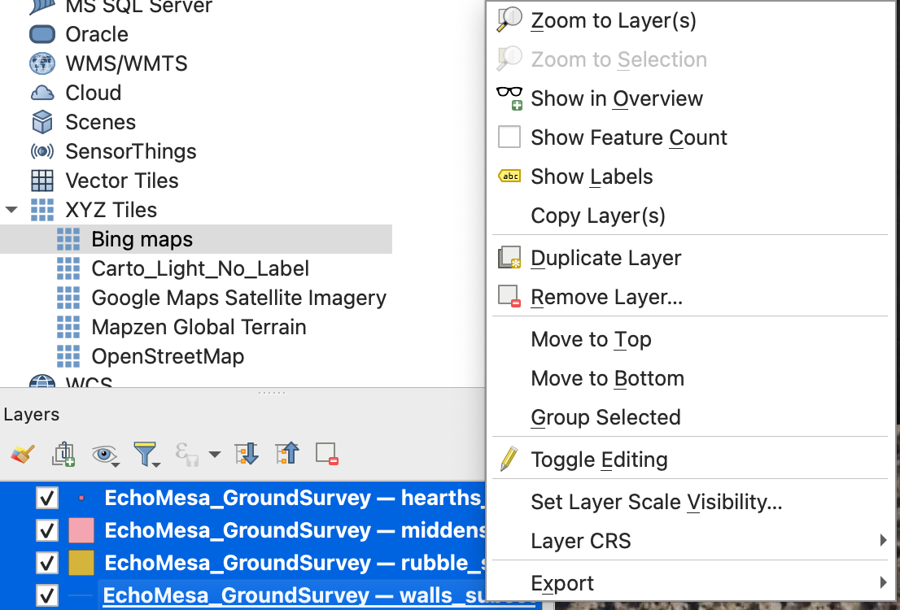{fig-align="center" width="60%"}

::: callout-important
## EXERCISE 3

Based on the mapped archaeological features and @herrmann2018, discuss how ultra-high resolution orthoimagery and DEMs we produce using drones can help archaeologists discover, document, and interpret ancient sites and landscapes.
:::

### Thermal Imagery

Finally, add `echocanyon_thermal_8may25_utm.tif` as a raster layer. You may notice that the image looks rather "muted."

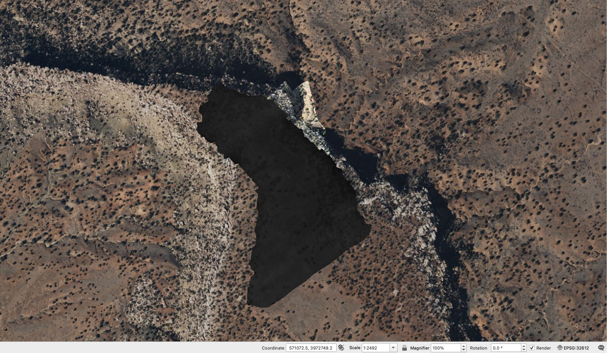{fig-align="center" width="100%"}

To troubleshoot, we may need to examine the distribution of the pixel values. Right click on the thermal layer and select `Properties`. In `Layer Properties` window, go to `Histogram` and click `Computer Histogram`.

::: callout-note
For a single-band image such as this thermal image, a GIS program typically maps the range of pixel values onto a grayscale (0-255), from black for the lowest value to white for the highest.
:::

As you can see here, the raster displays poorly because a few outlying values stretch this range. Most pixels fall within only about 10% of it, so they are squeezed into a narrow band of grays, and the variation within the histogram's main peak is hard to see.

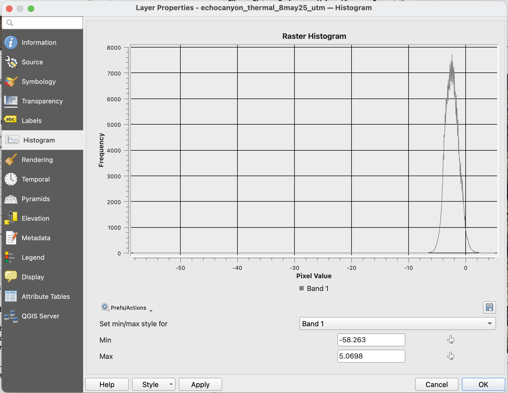{fig-align="center" width="80%"}

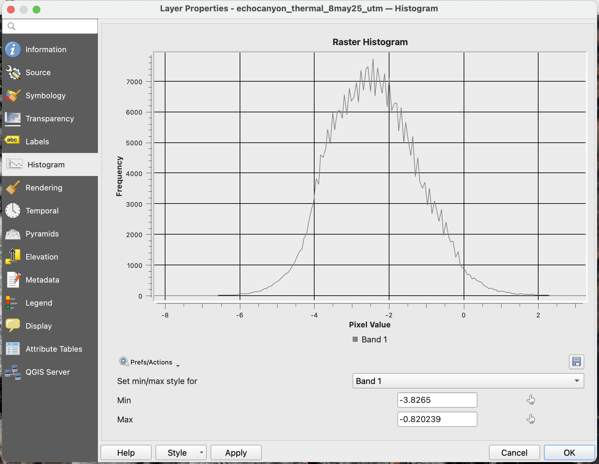{fig-align="center" width="80%"}

To change this, go to `Symbology` dialog in `Layer Properties`. In the `Min/Max Value Settings`, select `Cumulative count cut` and choose `10` - `90`%.

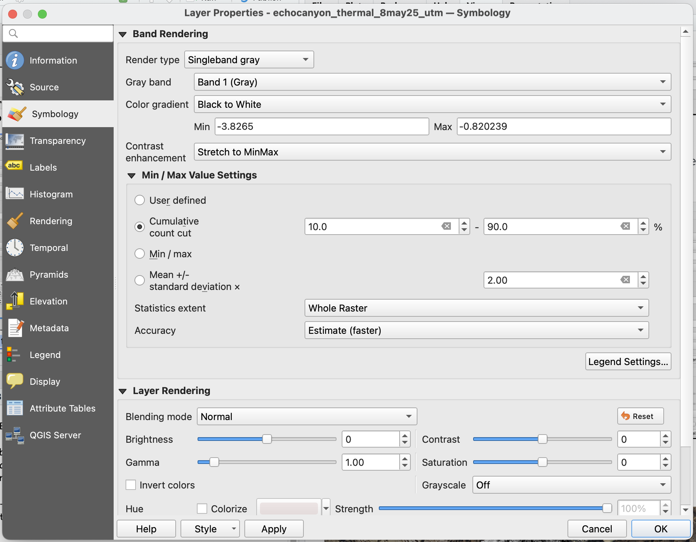{fig-align="center" width="80%"}

You should now have a much better visualization of the thermal data.

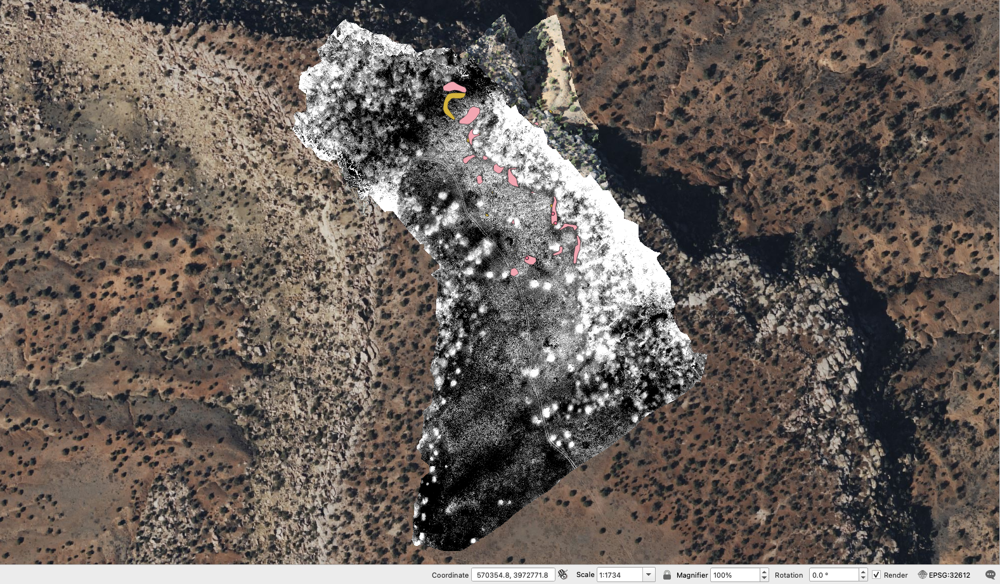{fig-align="center" width="100%"}

## Archaeology of Echo Mesa

A typical archaeological site in Echo Canyon consists of stone building foundations and artifact scatter at the surface:

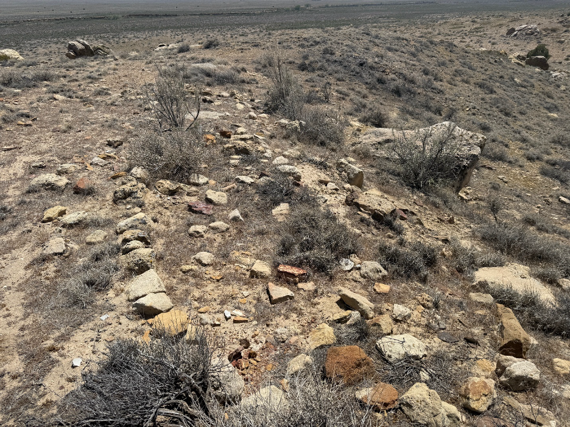{#stone-foundation fig-align="center" width="100%"}

In QGIS map view, one similar site can be found near coordinates `570324.3092,3972901.0257`. Locate this point and set the scale to `1:30`.

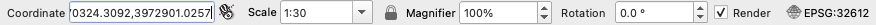{fig-align="center" width="100%"}

Toggle off all layers except for the orthomosaic. Can you see the archaeological feature here?

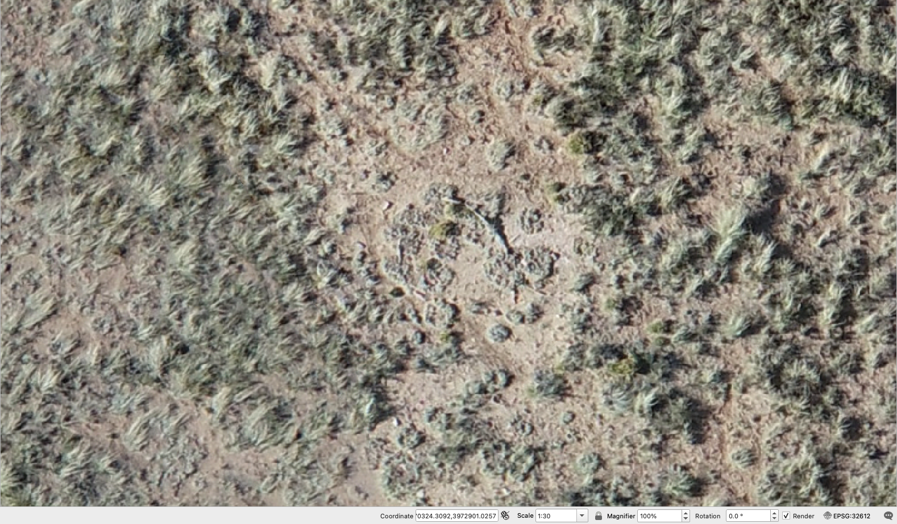{fig-align="center" width="100%"}

To map this feature, we will need to create a new vector layer. Go to `Layer` -\> `Create Layer` -\> `New GeoPackage Layer...`. In the pop-up window, first click `...` next to the `File name` and select a location to save your layer with a reasonable name.

For `Geometry type`, select `Polygon`, and select `Project CRS`. In `New Field`, write `ID` in the `Name` field and change `Type` to `Integer`. Press `Add to Fields List`. Finally, press `OK`.

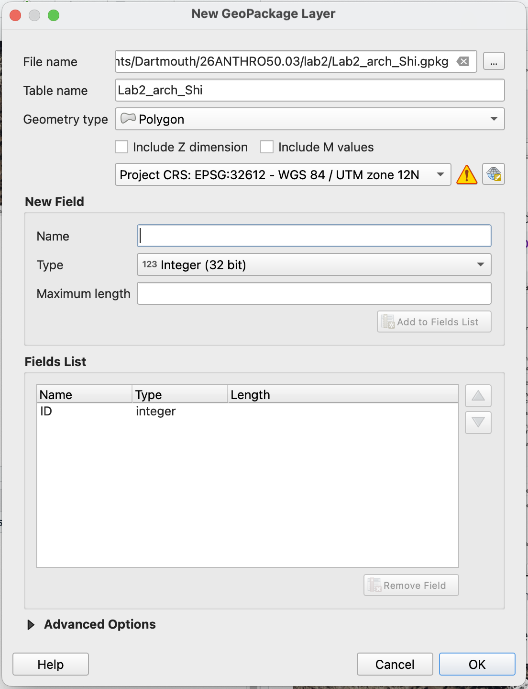{fig-align="center" width="80%"}

In the `Layers` panel, right-click on the newly created layer and select `Toggle Editing` ({width="5%"}). This will let you edit the `.gpkg` file directly. In the top toolbars, select `Add Polygon Feature` (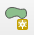{width="5%"}) and start tracing the boundary of the archaeological site. Once done, hold `Ctrl` and click anywhere on the map. In the pop-up window, put `0` in the `ID` field, indicating this is the first site you map.

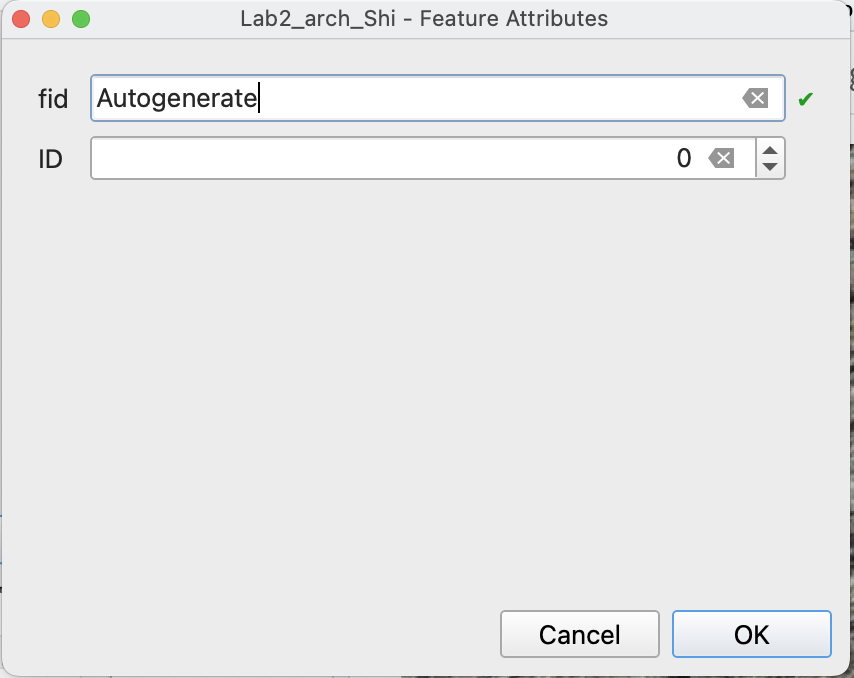{fig-align="center" width="60%"}

There you go — you have just mapped your first archaeological feature in QGIS! It should look something like this:

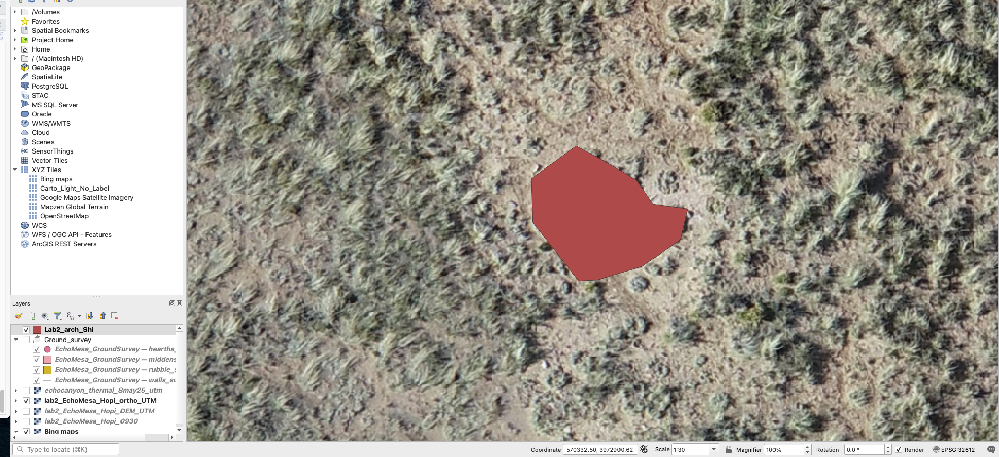{fig-align="center" width="100%"}

Once you are done, select `Save Layer Edits` ({width="5%"}) in the top toolbar. Click `Toggle Editing` ({width="5%"}) again to exit edit mode.

::: callout-important
## EXERCISE 4

Are you able to identify the archaeological feature you just mapped in the color orthoimage, DEM, or thermal mosaic of Echo Canyon? Was this feature previously mapped in `EchoMesa_GroundSurvey`? Can you see other previously mapped features in the rasters?

:::

::: callout-important
## EXERCISE 5

Are you able to recognize any other possible archaeological features? What data did you use to find these features? Please provide screenshots in your response, edit your newly created layer to include these features, and upload your `.gpkg` to Canvas. Make sure that the file name contains your name.
:::

::: callout-important
## EXERCISE 6

Based on your work and our readings, including @materazzi2022 and @paulsen2026, describe how thermal and near-infrared imagery are used by archaeologists to reveal features that are not visible otherwise.
:::
