## Background

The central power of GIS is in the ability to load multiple spatial datasets into a single map frame, and then compare them to one another, either visually or quantitatively. [Raster graphics](https://en.wikipedia.org/wiki/Raster_graphics) are grids of pixels, such as CORONA imagery, scanned maps, and elevation models. [Vectors](https://en.wikipedia.org/wiki/Vector_graphics) are composed of discrete data points, such as points, lines, and polygons, which include archaeological sites, rivers, and soil types. Rasters are usually larger files and require more computing power to process.

This page will guide you to load a Bing basemap and three rasters into a new project in QGIS.

## Basemaps

In QGIS, basemaps are background reference layers, such as the satellite imagery in CORONA Atlas. They are usually raster images streamed from an online server, so you can view them but not edit them. Basemaps provide visual context rather than data for direct spatial analysis.

Start a new project in QGIS using `Project` -\> `New` and save it in a folder for `ANTHRO_50_03_LAB1`. Because of the highly iterative nature of GIS work, give your project a specific and descriptive name: *e.g.*, `DA2609_Lab1_YourName_1`. Start your filename with a letter and not a number.

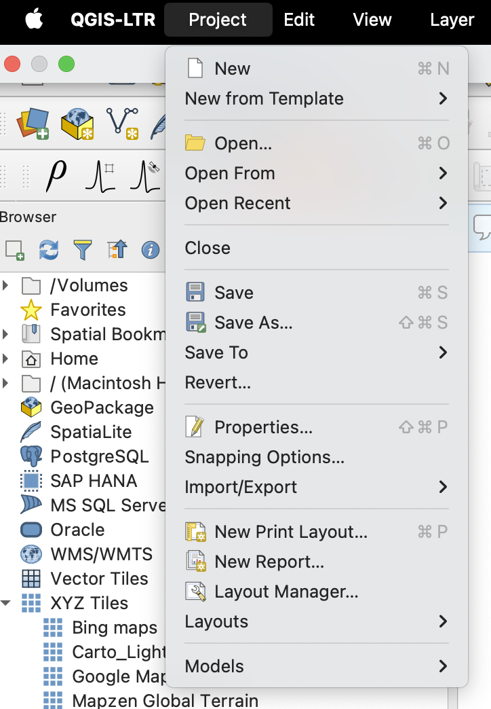{#Q-new_project fig-align="center" width="50%"}

::: callout-tip
Make sure to save your project regularly by pressing `Ctrl/CMD` + `s` or the button 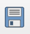{width="5%"} near the top.
:::

You will notice that the map view is currently blank, which makes it hard to navigate. We need to add a basemap. Locate the ["Browser" panel](#Q-browser) on the left side of the screen.

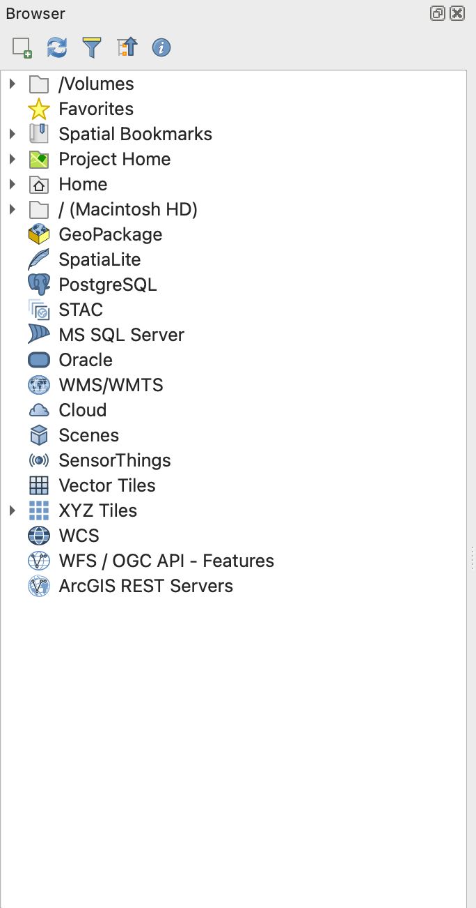{#Q-browser fig-align="center" width="50%"}

Right-click on **XYZ Tiles** and select **New Connection**. Type a name for the layer, such as `Bing Satellite`. Paste the following into the **URL** field and click OK: `http://ecn.t3.tiles.virtualearth.net/tiles/a{q}.jpeg?g=1`.

Double click on the XYZ Tiles Connection you just created, and you should be able to see the basemap loaded.

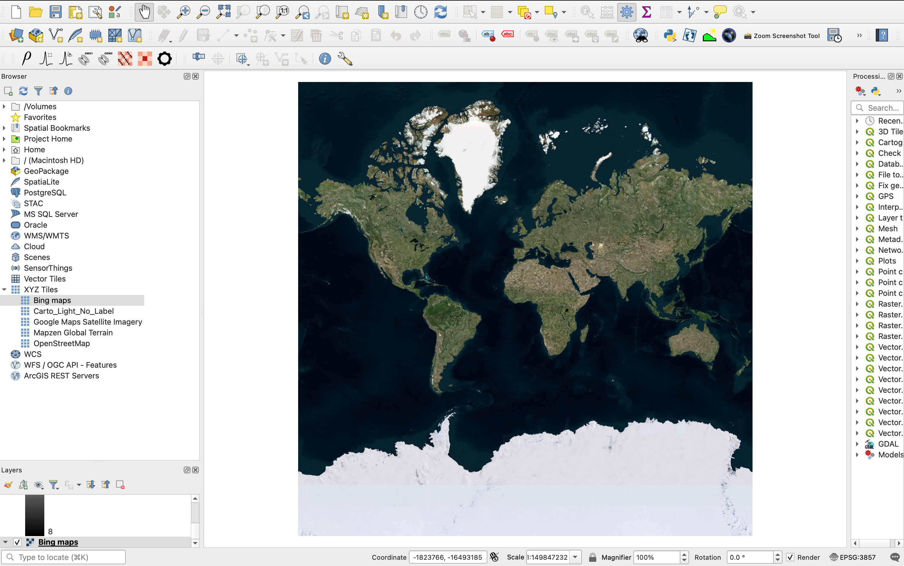{#QGIS-basemap width="100%"}

::: callout-caution
Make sure the coordinate reference system (CRS) in the right bottom corner is set to EPSG:3857, used for display by many web-based mapping tools. This is a [projected coordinate system](https://en.wikipedia.org/wiki/Projected_coordinate_system) that flattens the 3D, curved surface of the Earth (a [geographic coordinate system](https://en.wikipedia.org/wiki/Geographic_coordinate_system)).
:::

## Adding Raster Layers

### CORONA `ds1105-1025df057.tif`

To add a raster in QGIS, select `Layer` -\> `Add Layer` -\> `Add Raster Layer`.

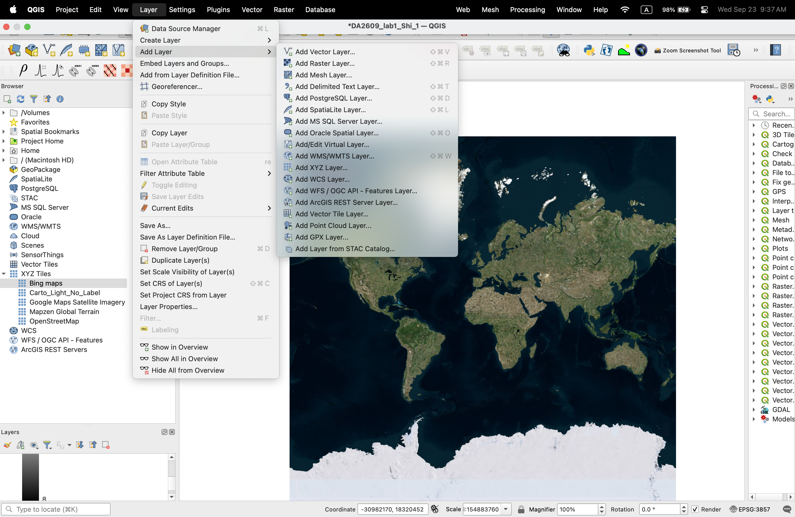{width="100%"}

In the [Data Source Manager](#Q-data-source), under `Source`, locate `ds1105-1025df057.tif` stored in your computer and click `Add`.

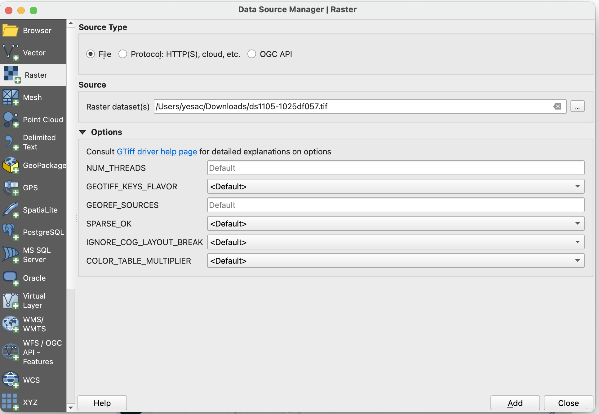{#Q-data-source width="100%"}

Return to the map view. In the `Layers` window, right-click on the raster layer we just added and select `Zoom to Layer(s)`. Wait for a few moments for the image to load.

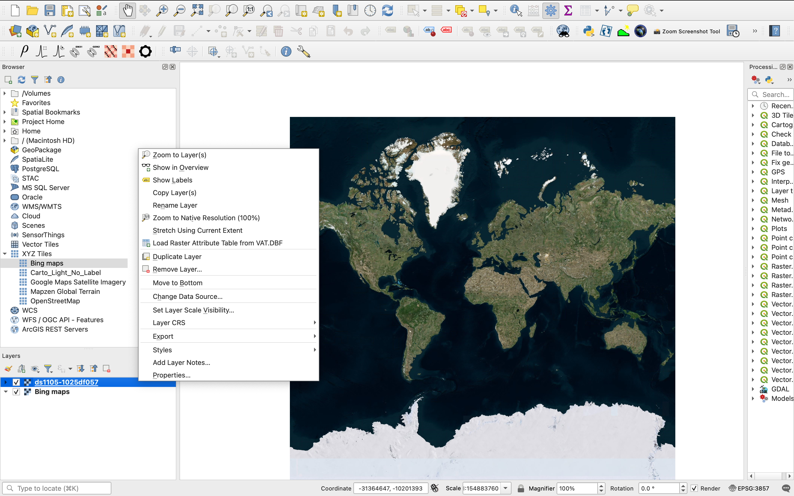{width="100%"}

::: callout-caution
Files are linked to a GIS — not stored — and any moved files must be re-linked in QGIS.
:::

In the `Layers` window, toggle off the raster layer to see the underlying satellite imagery. Toggle it on again. In the `coordinate` near the bottom of the interface, type in `4518140.3,4402634.6` to find Tell Beydar again. In `scale`, type in `1:5000` (1 cm on the screen represents 5,000 cm on the ground).

::: callout-important
## EXERCISE 3

Toggle on and off the CORONA image, look for changes evident in the close vicinity of Tell Beydar. Please describe these changes and what you think may have caused them. Be sure to describe their location relative to the Tell.
:::

### Survey Map from Tony Wilkinson (1948-2014)

Download [`Lab1Wilkinson.zip`](https://drive.google.com/file/d/16yFWV53wTq_G2dXX2GcJkw123Q21ntRL/view?usp=drive_link) and unzip it in your computer. Add a raster layer that links to `Wilkinson_2002.tif`. This map was produced by an archaeologist, Tony Wilkinson, who did an archaeological survey in the area around Tell Beydar. The map has already been [georeferenced](https://en.wikipedia.org/wiki/Georeferencing), meaning that it has been transformed to match the other geographical data.

The imported map may look funny in QGIS. This is because the raster only contains pixels with two values, 0 and 255, and the program automatically assigns a color to each of these two colors.

To correct this, right-click on `Wilkinson_2002` layer, select `Symbology`, and change `Render type` to Singleband gray.

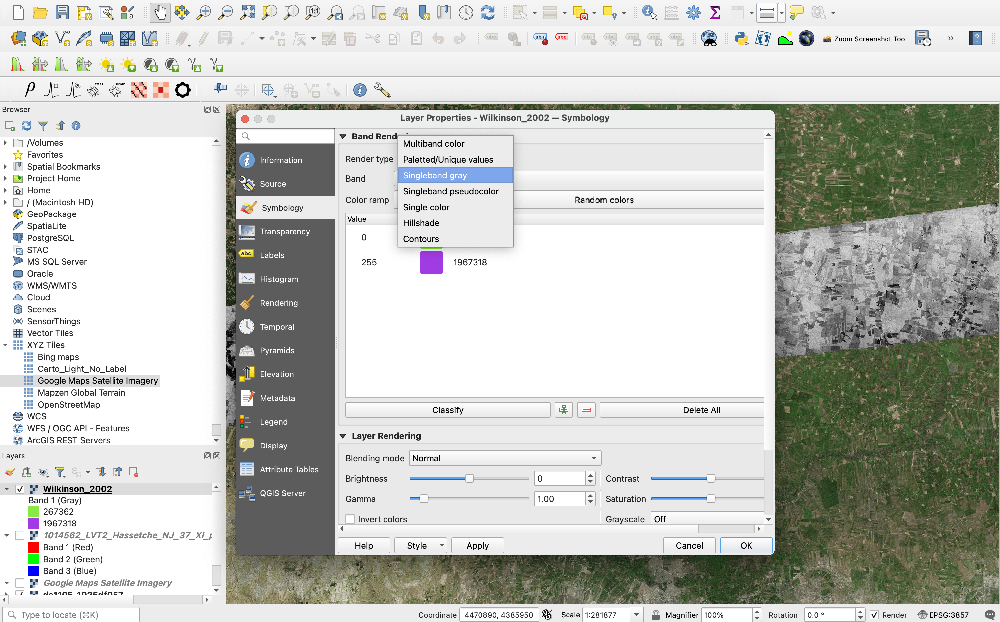{#qgis-symbology width="100%"}

While you are at it, locate `Transparency` tab on the right side of the layer properties window, adjust the opacity of this layer to 50%.

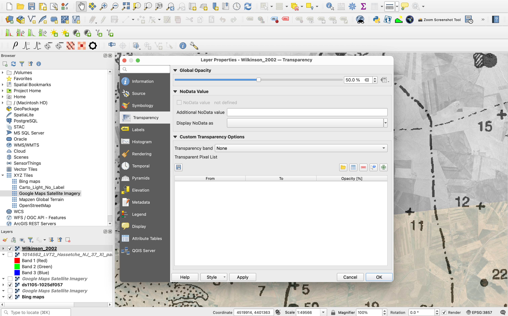{#qgis-opacity width="100%"}

### 1938 Historical Map

Now it is time to put what you learned about rasters to practice! Download [`1938_FrenchMap.zip`](https://drive.google.com/file/d/11YXCK4UQl-P3wwYI_Iw9eOlBaM5fp97W/view?usp=drive_link) and unzip it. Add `1014562_LVT2_Hassetche_NJ_37_XI_partie_sud_NJ_37_V_1938.TIF` as a raster layer. Change the layer's opacity to 60%. Toggle off layer `Wilkinson_2002`.

While the map has been similarly georeferenced, the georeferencing is not perfect for [this historical map](#1938-historical).

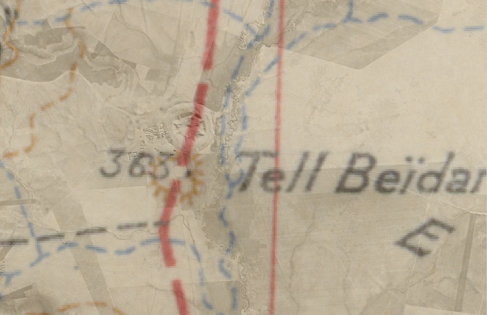{#1938-historical width="100%"}

In QGIS, you can also measure distance and area in the map view. To do so, use the `Measure Line` tool in the top toolbar and click on the points in the map view.

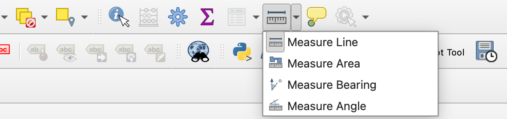{#measure-q fig-align="center" width="60%"}

::: callout-important
## EXERCISE 4

With both the CORONA image and the 1938 map toggled visible in the Layers panel, measure the georeferencing error of the 1938 map. To do so, first measure and **report** the distance in meters between the center of Tell Beydar on the CORONA image and its center on the map. Recall that the CORONA image has a [spatial resolution](https://en.wikipedia.org/wiki/Spatial_resolution) of about 2 meters per pixel here. **Report** error/offset between the map and the CORONA image in CORONA pixels.
:::
