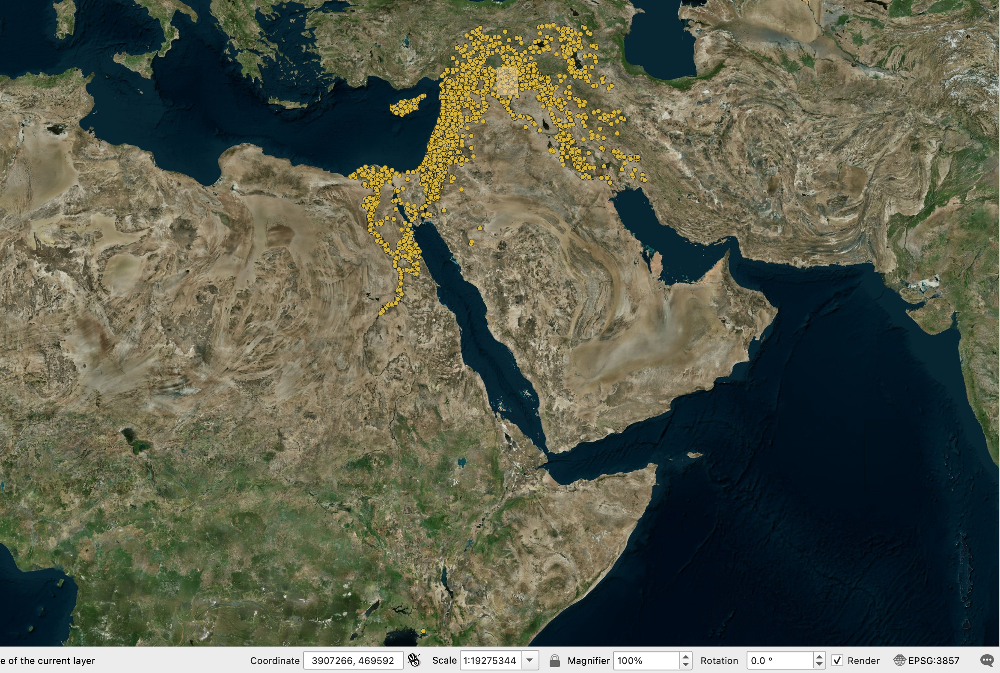
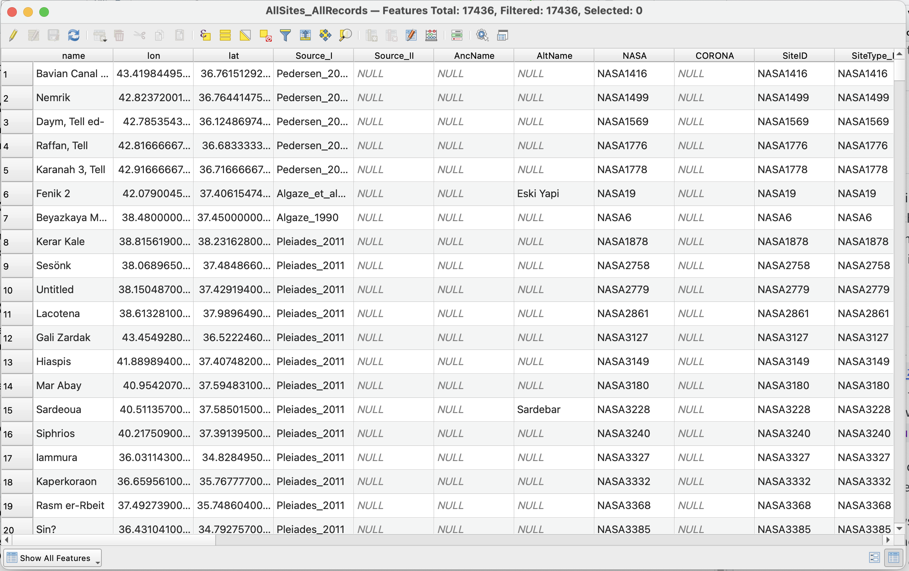
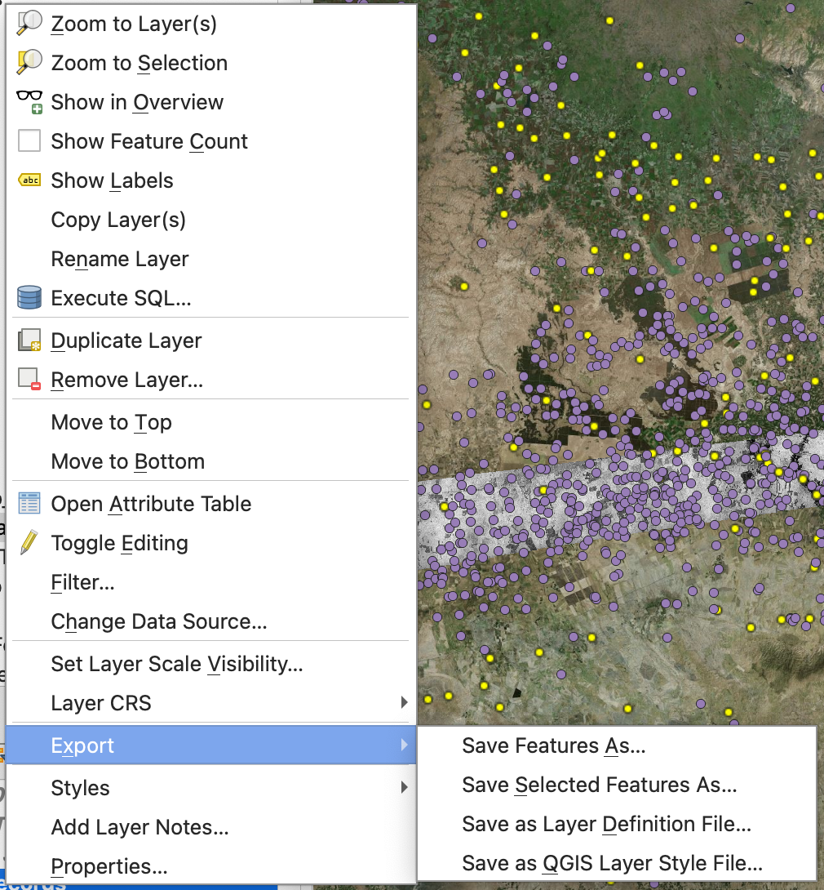
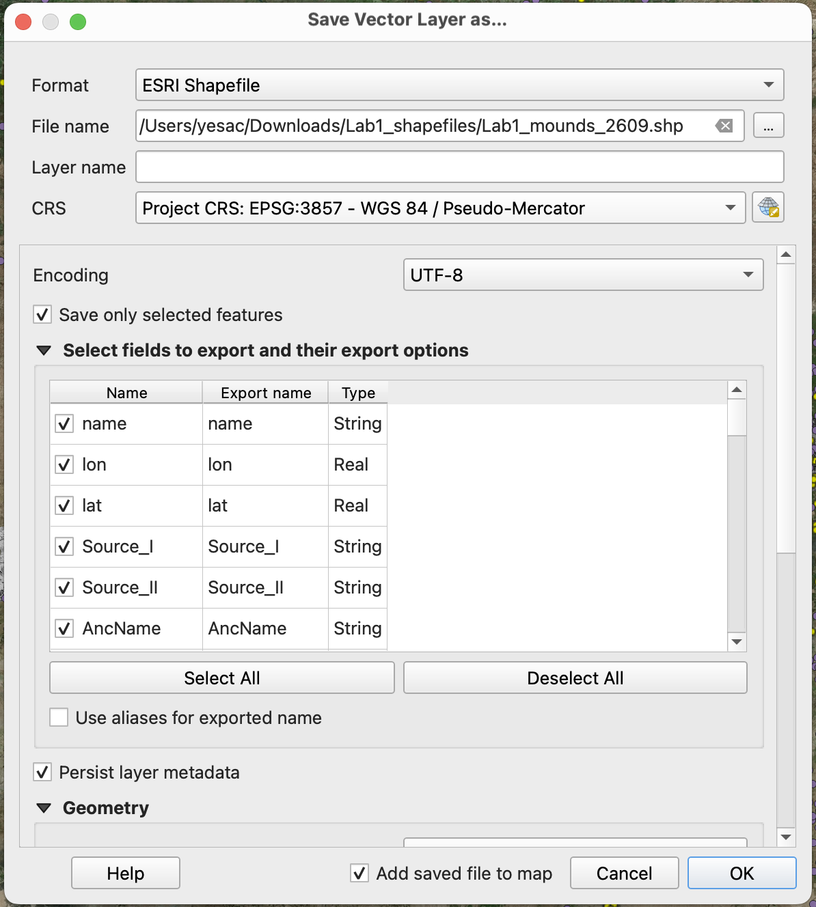
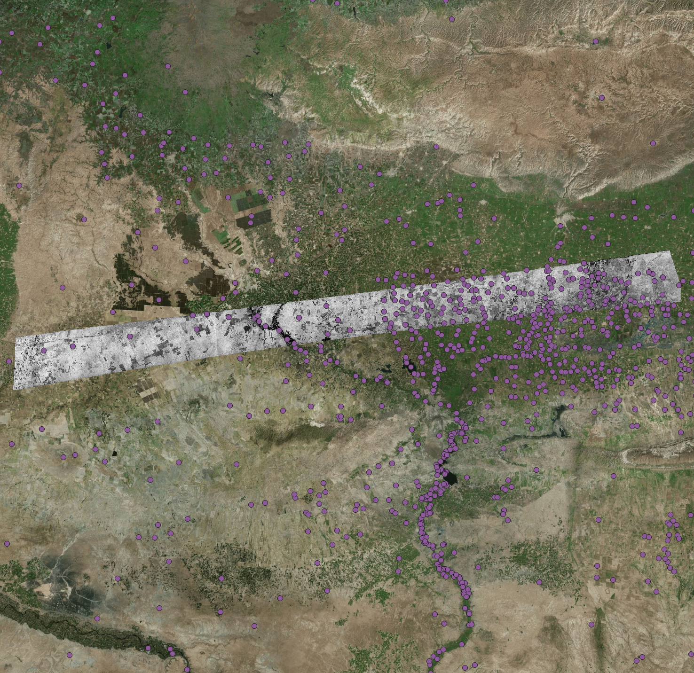

## Background

Vector data are discrete points, lines, and polygons, and often have tables attached to them containing ancillary information. The most common file type for storing vector data in QGIS is a “shapefile” (.shp).

## Adding Vectors

Download a shapefile of all archaeological sites in this region: [`Lab1_All_Sites.zip`](https://drive.google.com/file/d/1wTdCl3f3wcVAkd2wMedKyv0yE_wreJ6l/view?usp=sharing). Similar to adding rasters, navigate to `Layer` -\> `Add Layer` -\> `Add Vector Layer...`. In the window, select `AllSites.shp` under `Source` and add to the map.

Right-click on the newly added vector layer and select `Zoom to Layer(s)` to see its full extent.

`Zoom to Layer(s)` allows you to see the full extent of a vector layer, but sometimes an outlier can unduly affect the map view. In this case, there seems to be a data point in an unlikely place in the southern end of the map view.

{#zoom-all-sites width="100%"}

Use the `Identify Features` {width="5%"} in the top toolbar and click on this outlier to examine it.

::: callout-important
## EXERCISE 5

Find the point that lies far from the rest of the dataset. Using the Identify Results panel, **report** its name, latitude, and longitude. Do you think this point was there by design, or is it an error? If it is an error, what value seems to have been wrong?
:::

## Vector Attributes

For now, let us focus on the region near Tell Beydar. Toggle on only three layers: `AllSites`, `ds1105-1025df057`, and the basemap. Zoom to `ds1105-1025df057`. Examine the general distribution of these sites and answer the following question:

::: callout-important
## EXERCISE 6

Are there any patterns in the general distribution of all archaeological sites vis-à-vis geographical features such as water and topography?
:::

Sometimes, we want to examine archaeological features of a particular type. To do that, right-click on `AllSites` and select `Open Attribute Table`.

In the `Attribute Table`, you can see each data point has some values or "attributes" associate to it. In the table, locate the column/field `Type`, which contains string/text values such as `mound`, `other`, `flat`.

{#attribute-table width="100%"}

To select all features that are of the `mound` type, click on `Select by Expression` tool ({width="5%"}) in the top toolbar. In the expression window, type in the following [expression](#mound-query) and press `Select Features`.

``` {#mound-query}
"Type" = 'Mound'
```

Close the `Select by Expression` window. Now, all the features that contain a `Type` value of `Mound` should be highlighted in the attributes table.

With the attributes table open, go back to the map view and right-click on the vector layer. Select `Export` -\> `Save Selected Features As...`

{#export-selected width="80%"}

In the window, select `Esri Shapefile` as the Format and use the `...` button next to `File name` to save it in your computer with a name such as `Lab1_mounds_2609.shp`. Change the `CRS` to Project CRS. Click `OK`.

{width="80%"}

The new selected dataset should be added to your map. Toggle off the original vector layer, and you should be able to see all mounded sites in the region.

{width="80%"}

::: callout-important
## EXERCISE 7

Examine the attribute tables of both vector layers, how many features are there in each dataset? What is the percentage of mounds among all sites? As a bonus question, what is the percentage of the mounded site surveyed by `Tuna`?
:::

## Image Analysis

Now you have created all layers needed for this lab. Toggle on and off the layers, change opacity and symbology of these layers, and answer the following questions.

::: callout-important
## EXERCISE 8

How commonly are mounded sites documented in the vector database also recorded on the 1938 French map of the Beydar area? A qualitative description is fine for this exercise.
:::

::: callout-important
## EXERCISE 9

Tony @wilkinson2003 argues that the large, radial route systems found surrounding many sites in northern Mesopotamia are generally only associated with sites of the Early Bronze Age. Evaluate this theory using the CORONA imagery and your mounded site distribution.
:::
