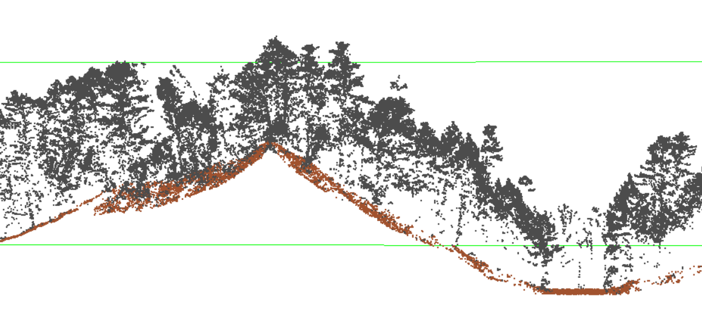
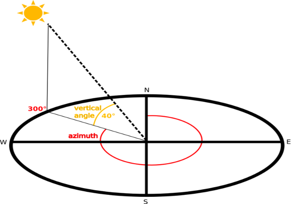
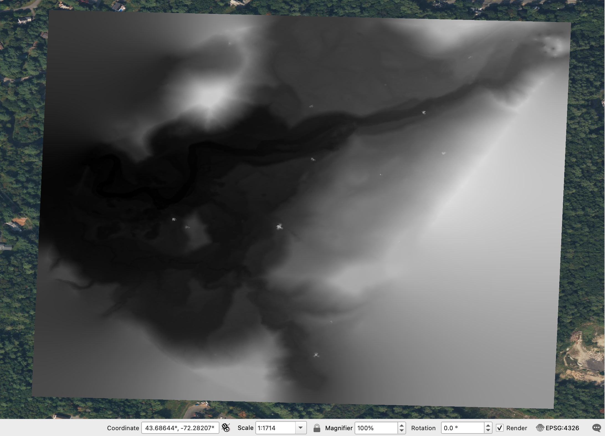
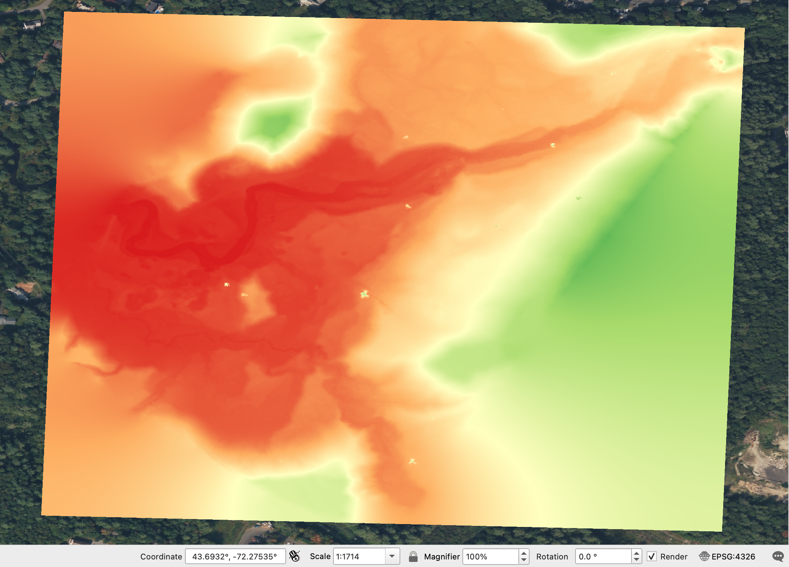
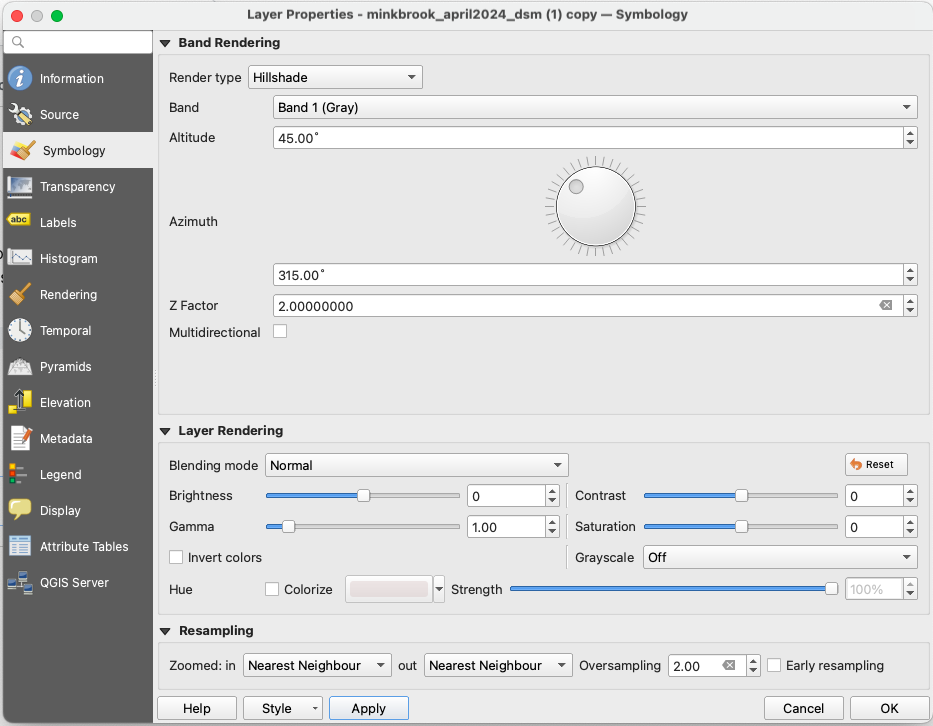
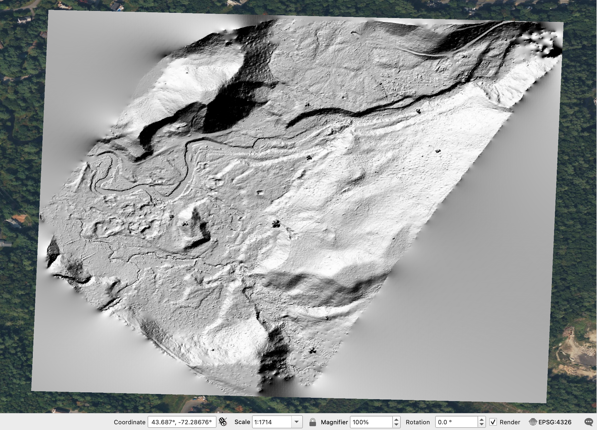
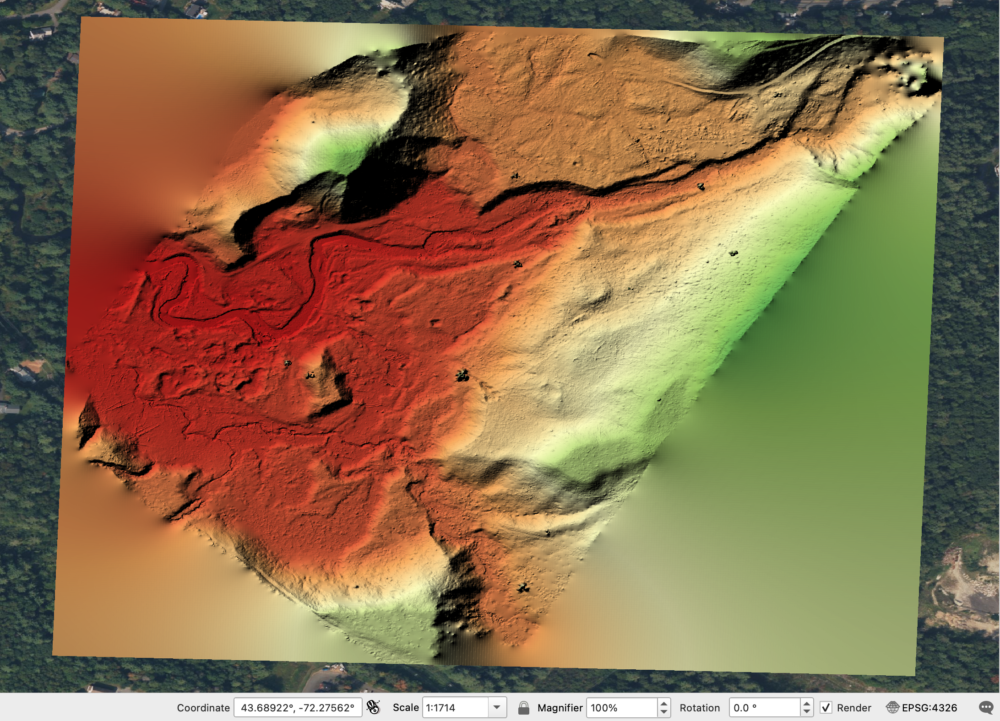
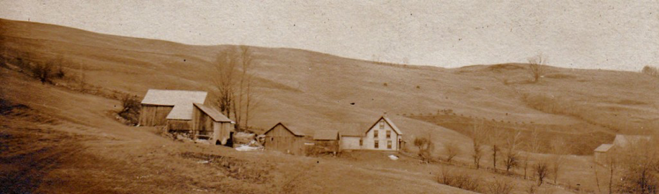
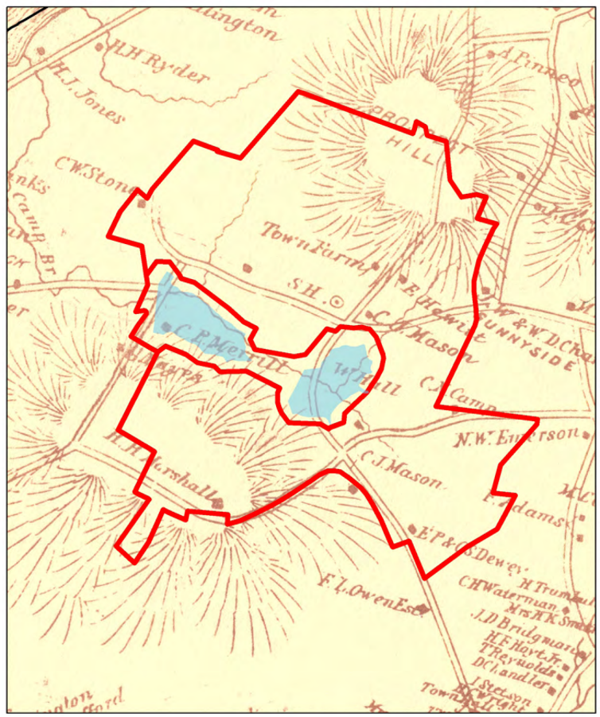
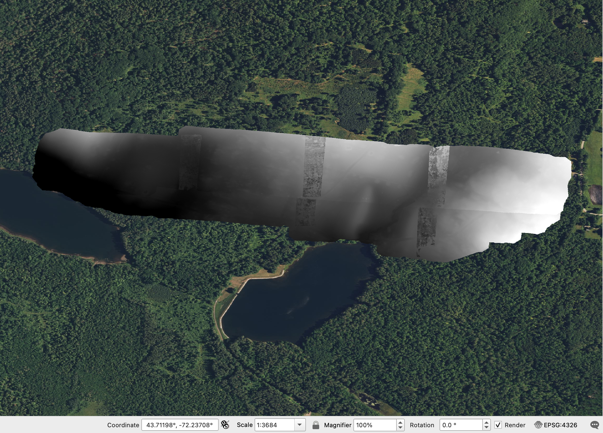

## Drone Lidar of Mink Brook

In this section of the lab, we will search for archaeological features in drone lidar data produced by the [SPARCL team](https://sites.dartmouth.edu/sparcl/) used the DJI L1 lidar sensor. This is the same sensor and drone used in the @casana2023a paper on Picuris Pueblo from our readings this week. The public lidar is typically 1m spatial resolution, compared with 10cm resolution in drone lidar (100x better!). This enables us to much more clearly visualize archaeological features.

For this part of the lab, the raw point clouds derived from the lidar sensor have been filtered to remove as much vegetation as possible, and then interpolated to create a continuous, “bare-earth” model of the ground. This was achieved by classifying points as unclassified (1, black in the [picture](#lidar-class) below) or ground (2, brown) using [LASTools](https://lastools.github.io/).

{#lidar-class fig-align="center" width="100%"}

### Hillshade visualization

To reveal the subtle agricultural features we will use a variety of “hillshades." These are simply raster images in which we have digitally illuminated them from different low angles. By moving the imaginary light source around, we can often highlight topographic features that are otherwise invisible. Most hillshades are labeled by the direction of the faux sun or light source being used to illuminate them.

{fig-align="center" width="80%"}

In QGIS, add [`minkbrook_april2024_dsm.tif`](https://drive.google.com/file/d/1f1gNmDGRoNBjVTC1tto7urjAn3V_qwWN/view?usp=sharing), [`poorfarm25_part1_terradem.tif`](https://drive.google.com/file/d/15lW5FhXuT0pniYXAdfE9OO5rGx0jVAuR/view?usp=drive_link), and [`poorfarm25_part2_terradem.tif`](https://drive.google.com/file/d/1-n95LUnTxJcaVAn8Xm-gac6hzoksJLZ4/view?usp=sharing) as raster layers. Zoom to `minkbrook_april2024_dsm`.

{fig-align="center" width="100%"}

Right click on `minkbrook_april2024_dsm`, choose `Properties`. And in the `Symbology` dialogue, choose `Singleband pseudocolor` as the `Render Type` to visualize the elevation better.

{width="100%"}

Next, right-click on the DEM layer again, select `Duplicate Layer` ({width="20%"}). In the new layer, possibly named `minkbrook_april2024_dsm copy`, change Symbology `Render type` to `Hillshade`, and change the `Azimuth` to 315°, `Z-Factor` to 2. Rename this layer by navigating to `Information` dialog and change the `Layer name` to something like `minkbrook_april2024_dsm_hs315`.

{fig-align="center" width="80%"}

Now you should see something like this:

{fig-align="center" width="100%"}

In the `Layers` panel, drag the color-ramp DEM visualization over the top of the hillshade. In the color-ramp, go to `Layer Properties` and change `Symbology` -\> `Layer Rendering` -\> `Blending mode` to Multiply.

{fig-align="center" width="100%"}

Now duplicate the hillshade layer twice and change each of the duplicated layers' hillshade azimuth to 0° and 45°. Rename these layers properly.

::: callout-important
## Exercise 2

Which hillshade visualization, in terms of its azimuth, shows the cellar holes better? With reference to the orientation of the cellar holes, explain why.
:::

Beyond the two cellar holes, we also saw **mill footings** and **stone clearance walls** during our visit. Can you identify them in QGIS? Also look for anything else you think might be an archaeological feature (as opposed to geological or modern trees). Experiment with other hillshades in to see which ones are most useful in revealing archaeological features.

Now move the vector layer that contains the two polygons you drew over the top of all layers in `Layers` panel. `Toggle Edit` ({width="5%"}) and `Add Polygon Feature` ({width="5%"}). Map the additional archaeological features before saving layer edits.

::: callout-important
## Exercise 3

Were you able to locate all the known archaeological sites and features in Mink Brook? Did you find any potentially unrecorded things? Provide a screenshot of your saved archaeology layer.
:::

## Drone Lidar of the Dartmouth Poor Farm

During the 19^th^ century, the town of Hanover constructed a “poor farm”, a place for homeless, indigent, or poor people to live. These folks used to reside on the south side of Hanover, but were moved several miles away to an area of farms and fields. The Poor Farm was constructed near several existing farms and a small schoolhouse off Etna Road, as shown in this 1870s photograph.

{fig-align="center" width="100%"}

In 1892, two reservoirs were constructed nearby to provide drinking water for Hanover (this is still where we get our water). Following a cholera outbreak at Cornell in 1907, the residents of all the farms and the poor farm were forcibly relocated again in order to protect the water supply, The area remained fenced off until it was reopened for limited recreation in 2017. Today, remains of several of the 19^th^ century and earlier buildings are still visible, but many more are hidden in the forest. A map from the late 19^th^ century shows the location of the Poor Farm “Town Farm."

{fig-align="center" width="80%"}

A drone lidar survey conducted in April 2025 reveals many of the hidden features. Zoom to layers `poorfarm25_part1_terradem` and `poorfarm25_part2_terradem`.

{fig-align="center" width="100%"}

Visualize the DEMs in different hillshade configs.

::: callout-important
## Exercise 4

What archaeological features are you able to identify in the Poor Farm/Trescott Reservoir lands lidar imagery? Report at least two sites (of preferably different types) with coordinates and screenshots.
:::

::: callout-important
## Exercise 5

How do the discoveries reported by @chase2011 and @pärssinen2026 change our understandings of the settlement and land use histories in Belize and the Amazon Basin respectively? What do you think might be missing from the lidar record that one might be able to see using other methods?
:::

::: callout-important
## Exercise 6

What kinds of archaeological features are @casana2023a able to identify in drone lidar data from Picuris Pueblo that might not have been visible using other methods? What do you think the location, number or scale of agricultural features around Picuris Pueblo suggests about the history of land use at the site, its population, or the presence of forest cover in the highland Southwest?
:::

::: callout-important
## Exercise 7

Based on your readings and your analysis of Mink Brook as seen in the public, aircraft-acquired lidar data, discuss the advantages and disadvantages of aircraft-acquired *versus* drone-acquired lidar for archaeology.
:::
