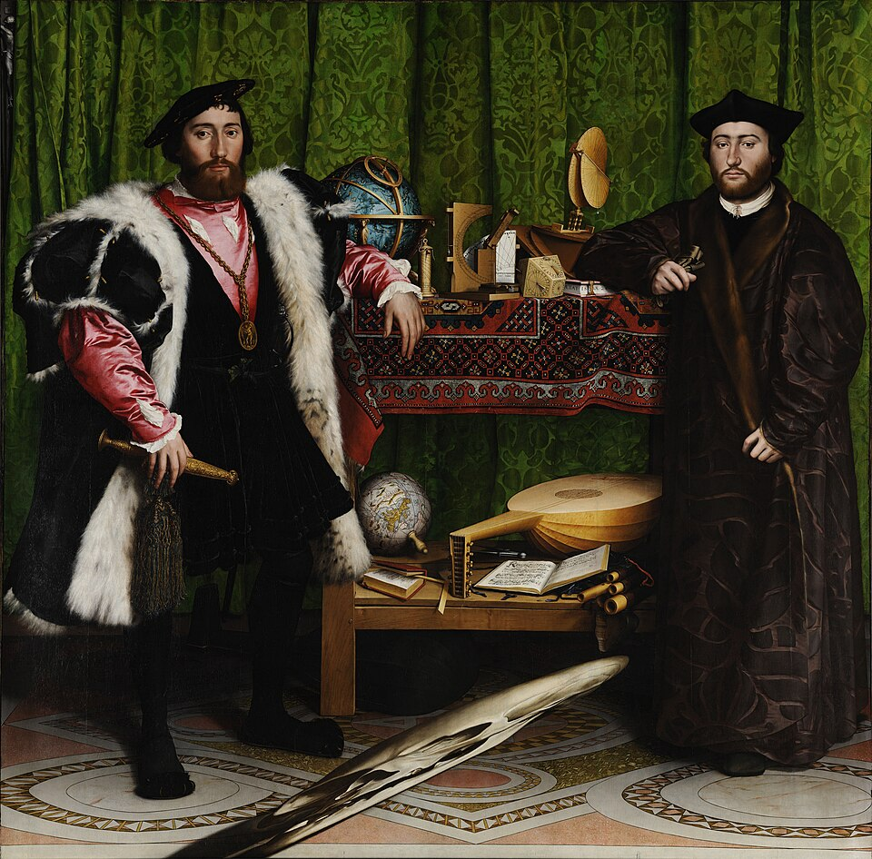

# Welcome {.unnumbered}

This website is designed to guide you through the lab assignments for ANTHRO50.03 Digital Archaeology (2026 Fall Term). There will be eight graded lab assignments, added to this website throughout the term. All completed assignments should be uploaded to the Canvas site, unless otherwise noted.

{#Ambassador fig-align="center" width="100%"}
