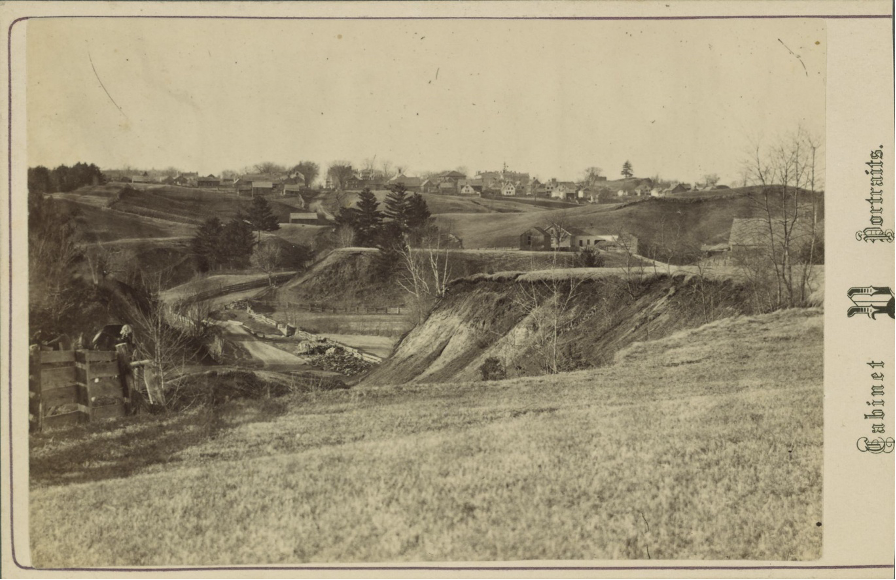
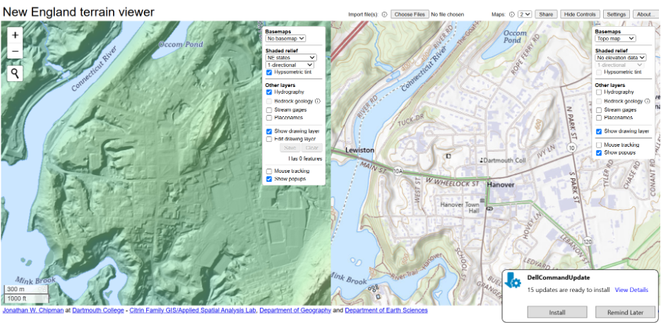
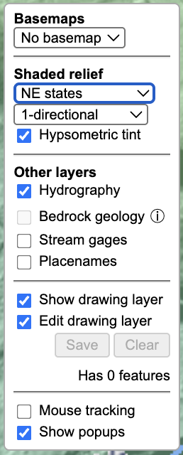

## Background and Objectives

In the common imagination, forests are often thought of as wild and natural places, unchanging and pristine, but archaeology tells a different story. Forests have often been a cultivated and managed part of the landscape, relied upon for industrial fuel, timber harvesting, and grazing of animals. In other instances, forests have undergone cycles of clearance for conversion into farmland, such that the seemingly wild woodlands of today are in fact quite [recent regrowth](#old_photo_MB).

{#old_photo_MB fig-align="center" width="80%"}

In this lab, we we utilize a series of public and drone lidar datasets from Hanover Conservancy properties in our local area, including Mink Brook and others. First, we will explore publicly available lidar using an online viewer. Second, we will examine a drone-acquired dataset of lidar imagery. In both cases, we will attempt to locate archaeological features.

## File Downloads

For this lab, you will need to download a public and filtered drone-lidar dataset for the Mink Brook and Poor Farm near Dartmouth:

- [`minkbrook_april2024_dsm.tif`](https://drive.google.com/file/d/1f1gNmDGRoNBjVTC1tto7urjAn3V_qwWN/view?usp=sharing): A DEM/DSM model that is derived from the raw point clouds collected using a DJI L1 lidar sensor;

- [`poorfarm25_part1_terradem.tif`](https://drive.google.com/file/d/15lW5FhXuT0pniYXAdfE9OO5rGx0jVAuR/view?usp=drive_link) and [`poorfarm25_part2_terradem.tif`](https://drive.google.com/file/d/1-n95LUnTxJcaVAn8Xm-gac6hzoksJLZ4/view?usp=sharing): two-part DEM model of the Dartmouth "Poor Farm" off Etna Road.

## Public Lidar of Mink Brook

In this section of the lab we will explore lower-resolution, publicly available lidar imagery through an online viewer produced by Prof. Jonathan Chipman’s lab in the Department of Geography here at Dartmouth. The viewer brings tother all the local lidar data from various state and federal agencies into a user friendly platform. It is available [here](https://rcweb.dartmouth.edu/Geospace/lidar/newengland/).

{fig-align="center" width="100%"}

First see if you can locate Mink Brook. Compare how it appears in color aerial imagery *versus* what is revealed in the lidar by changing the `Basemaps` option for the right map. Try different lidar visualizations or `Shaded relief` for the left image.

{#contents-terrain-viewer fig-align="center" width="30%"}

By toggling `Edit drawing layer`, we can also add polygons directly on top of the lidar image like in QGIS. Select `Draw a polygon` {width="5%"} and map the two square cellar holes that we visited, one on each side of the brook. Press `Finish` every time you draw a polygon. Once you are done, press `Save` in the [`Contents`](#contents-terrain-viewer) panel, and this will download a `.geojson` file to your machine. You may need to allow popups for it to download.

::: callout-important
## Exercise 1

Which lidar visualization in the public terrain viewer shows the archaeological features better? Provide a screenshot of the webpage that covers both of the polygons you just drew.
:::

## Importing GeoJSONs in QGIS

Open QGIS, start a new project, and save it as `DigitalArch_Lab3_Name`. Add a basemap such as the `Bing satellites`, and make sure the CRS is set to `EPSG:4326`. Import the `data.geojson` as a vector layer with default settings.

::: callout-tip
While QGIS allows direct importation of `GeoJSON` files, many other programs, such as ArcGIS Pro, will require converting them to feature classes.
:::
